# Design Document

## Overview

「二次元 AI 智能体小镇」是一个二维码入口驱动的多智能体像素小镇 Web 应用。本设计的**最高指导原则**是：

> **UI 是 demo 的命脉，其他一切模块都是为画面注水**。如果 demo 现场没有一个评委一眼认出 Stanford Smallville 同款、并且觉得"画面顶"的小镇页面，那么 LLM、Memory、MCP、打榜、谷子、同人都是假的。

参考标杆：Stanford Smallville（Generative Agents 论文配套 demo）、a16z AI Town、Alicization Town。我们的视觉目标是这三者的并集 + 二次元厨力主题贴皮。

本设计相对于原版做了一次彻底的"叙事重心翻转"，遵循以下顶层取舍：

1. **UI-First 架构**：所有模块按"对画面的可见贡献"分层。Tier 0（可见小镇页面 + 仪表盘骨架）必须在黑客松前 12 小时内立起来，且**完全 Mock 数据驱动**，不依赖任何后端。任何后端模块都是后续往这两块画面里"注水"。
2. **Mock-First 数据管线**：手工编一份"假小镇剧本"作为独立的 npm 模块 `@erciyuan/mock-town`，前端直接消费即可演示"小镇活着"。后端服务上线后只是替换数据源，前端零改动。现场后端崩溃时一键切回 Mock 继续 demo。
3. **Vertical Slice 落地节奏**：把 48 小时拆为 8 个 Slice（Slice 0–7），每个 Slice 都是**独立可 demo 的画面切片**，自带 fallback 数据。失败的 Slice 不影响下一个 Slice。
4. **MVP 视觉优先于 LLM 真实接入**：Agent_Core 在 MVP 阶段由脚本/有限状态机/模板填充驱动，输出 Thought_Trace 的 Schema 与真实 LLM 输出在结构上不可区分；LLM 实时接入由特性开关 `feature.live_llm` 控制，归为 Stretch。
5. **脑—小脑分层**：Agent_Core（大脑：意图、对话、规划）与 Pathfinding_Engine（小脑：A* 寻路、动作帧）在进程内严格解耦，前者允许"慢且不确定"，后者必须"快且确定"（< 50 ms）。
6. **协议化世界**：小镇内的所有可交互对象（咖啡机、公告板、门、谷子货架、痛房）通过 MCP_Tool_Gateway 统一暴露为可调用工具。MVP 至少 2 个工具（`coffee_machine.brew`、`bulletin_board.post`），Stretch 扩展到完整工具集。
7. **本地优先 + 沙盒隔离**：Memory_System 默认使用本地 SQLite + 向量索引；工具调用在独立进程/容器沙盒内执行，单次调用 CPU ≤ 2s、内存 ≤ 256 MB。
8. **黑客松降级哲学**：系统对 LLM 不可用、Memory 抖动、WebSocket 断连等故障预先内置降级路径，并在 Observation_Dashboard 顶部展示 "DEGRADED MODE" 提示条。
9. **二次元厨力作为差异化爆点**：Ranking_System / Goods_System+Itasha_System / Doujin_Generator / Intervention_Interface 作为 Stretch 子系统，按现场时间预算逐项启用，不阻塞主链路。

技术栈选型与理由：

| 层 | 选型 | 理由 |
|---|---|---|
| 前端框架 | Next.js + React + TypeScript | App Router、SSR、Tailwind 生态、黑客松友好 |
| 渲染引擎 | **Phaser 3**（首选）或 Canvas + 自研 Tile Renderer | Phaser 自带 Tilemap、Sprite、相机、动画帧；与 React 通过 PhaserBridge 组件协作 |
| UI 组件 | Tailwind CSS + Headless UI + Framer Motion | Bento Grid 布局 / Glassmorphism / 转生动画 |
| Mock 数据 | `@erciyuan/mock-town` 内部 npm 包 | 假小镇剧本：10–15 角色、20–30 条 Thought_Trace、5–8 段对话、10 条热搜、5 篇同人 |
| 实时同步 | WebSocket（Node `ws` 或 Socket.IO） | 低延迟广播、心跳、重连原语成熟 |
| 后端运行时 | Node.js（与 Next.js 同栈）+ 独立 Python Sandbox（可选） | 同栈降低集成成本，Python 仅用于沙盒工具调用 |
| 持久化 | SQLite（better-sqlite3） + sqlite-vss/自建向量索引 | 文件级、零运维、便于现场 demo |
| LLM（Stretch） | OpenAI / 通义千问 / 本地 Ollama，三者通过 LLM_Adapter 抽象 | 单点不可用即切换 |
| 角色生成 | 预制像素角色池（MVP fallback） + Stable Diffusion / Live2D（Stretch） | 主链路不依赖外部模型 |

---

## Architecture

### Visual-First Architecture & UI Priority Pyramid

整个系统的优先级**不是**按经典分层（前端/后端/存储）来排，而是按"对评委可见画面的贡献"自下而上排列。下层是地基，必须先立得起来。

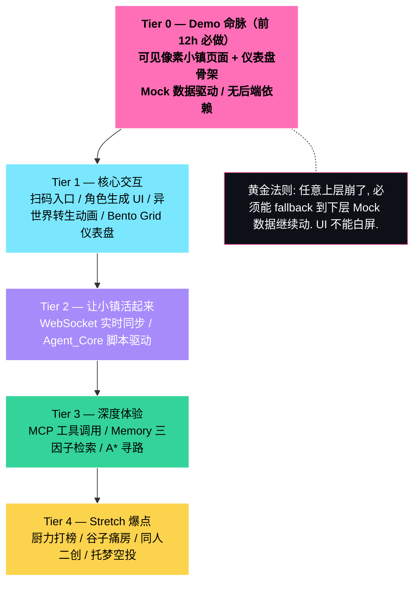

**金字塔分层规约**：

| Tier | 范围 | 数据源 | 失败时降级 | 黑客松时间窗 |
|---|---|---|---|---|
| **Tier 0** | Phaser Tile 地图渲染、3 个静态精灵、Bento Grid 卡片骨架、首屏 ≤ 2s | `@erciyuan/mock-town` 静态 JSON | 静态截图（极端 fallback） | 前 12 小时 |
| **Tier 1** | QR 入口页、角色生成表单、异世界转生动画、Bento Grid 全模块（含 Mock 思维链/对话流） | Mock 数据 + 简易 HTTP API | 表单只走前端，本地存 character | Tier 0 完成后 |
| **Tier 2** | Sync_Service（WebSocket）+ Agent_Core 脚本模式 → 让 Mock 角色"真的走起来"、"真的说话" | Town_System 内存事件总线 + Sync 推送 | `feature.mock_mode = true` 切回 Tier 1 Mock 数据 | 主链路核心 |
| **Tier 3** | MCP 工具（≥ 2 个）/ Memory 三因子检索 / A* 寻路 | SQLite + 沙盒进程 | LLM/Memory 故障 → DEGRADED MODE 红条 + 脚本兜底 | 余裕时间 |
| **Tier 4** | 打榜、谷子+痛房、同人 round-trip、托梦/空投 | 各 Stretch 表 | 单点关闭 feature flag，不影响主链路 | 现场加分 |

**铁律**：

- **Tier 0 必须在不启动任何后端进程的情况下能跑**：`npm run dev:ui-only` 启动 Next.js 前端，前端直接 `import { mockTown } from '@erciyuan/mock-town'`，画面就是活的。
- **任意 Tier N 崩溃**：通过 `feature.mock_mode = true` 把 Sync_Service 的数据源临时切回 Mock，画面继续动；顶部 DEGRADED MODE 红条提示。
- **不允许"画面白屏"作为任何 Tier 的失败模式**。Render_Engine 必须保证至少 Tile 地图 + 1 个静态精灵可见。

### 系统总览图

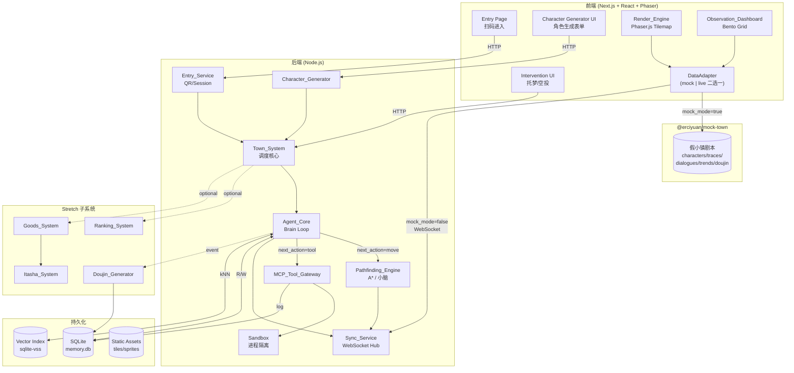

### 数据流：扫码 → 生成 → 投放 → 对话 → 仪表盘

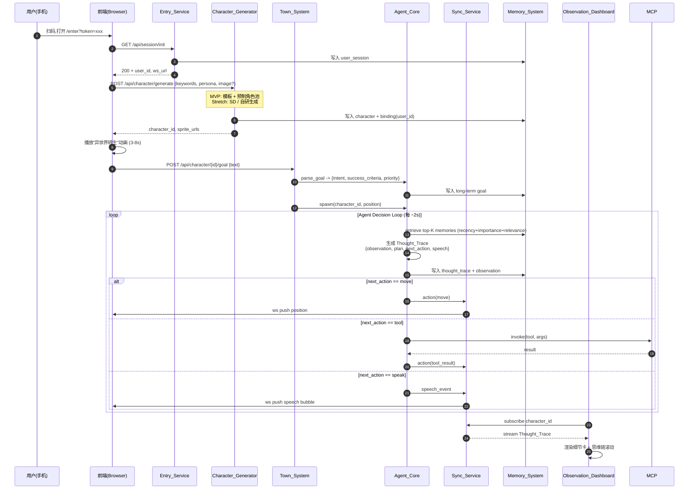

### 关键序列：用户托梦 → 角色记忆注入

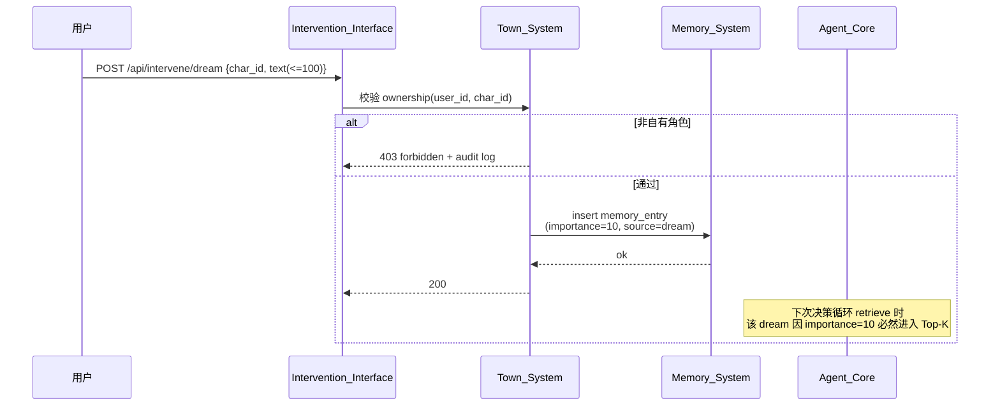

### 部署拓扑（黑客松现场）

- 单台演示笔记本运行 Next.js 全栈进程（前端 + 后端 API + WebSocket）
- SQLite 文件位于本地磁盘 `./data/memory.db`，便于现场重置
- 沙盒进程通过 `child_process.fork` + `vm` 模块或独立 Docker 容器（Stretch）启动
- 路由器开热点，二维码内 URL 指向局域网 IP，评委手机扫码即入
- **极端 fallback**：拔网线、把笔记本设置成飞行模式，前端依然能 `import @erciyuan/mock-town` 跑完整 Tier 0–1 演示

---

## Mock-First Demo Pipeline

这一节是本设计的"保命方案"。**任何后端模块的崩溃都不应让画面停下来**。

### Mock 数据集（@erciyuan/mock-town）

把"假小镇剧本"做成一个**独立的 npm 工作区包**，与前端、后端零耦合。

```
packages/mock-town/
├── package.json                  # name: "@erciyuan/mock-town"
├── src/
│   ├── index.ts                  # 统一导出
│   ├── characters.ts             # 10–15 个预制角色（含 sprite manifest, persona, owner）
│   ├── tilemap.ts                # 64×64 Tile 数据 (json) + tileset 元信息
│   ├── traces.ts                 # 20–30 条预录 Thought_Trace（覆盖 4 种 next_action）
│   ├── dialogues.ts              # 5–8 段对话片段（每段 ≤ 6 轮）
│   ├── trends.ts                 # 10 条小镇热搜（含趋势 up/down/flat）
│   ├── doujin.ts                 # 5 篇同人作品（4 篇四格漫画 + 1 篇短小说）
│   ├── timeline.ts               # 90 秒预录"小镇活着"事件流（pos/speech/thought 混合）
│   └── runtime.ts                # MockTownRuntime: 按时间轴回放事件流
└── README.md
```

**接口设计**：

```ts
// @erciyuan/mock-town
export interface MockTownAPI {
  characters: Character[]
  tilemap: TileMapData
  traces: ThoughtTrace[]
  dialogues: Dialogue[]
  trends: HotTrend[]
  doujin: Doujin[]

  /**
   * 启动一个 90s 循环的"假小镇"事件发射器，
   * 接口与 Sync_Service 的 ServerMsg 完全一致。
   */
  startRuntime(opts: { onEvent: (msg: ServerMsg) => void, loop?: boolean }): MockRuntimeHandle
}

export interface MockRuntimeHandle {
  stop(): void
  jumpTo(seconds: number): void   // demo 现场可手动跳到精彩片段
}
```

**关键约束**：
1. Mock 事件流的消息格式与 Sync_Service 输出**逐字段一致**（`type`、`char_id`、`x`、`y`、`frame`、`text`、`ts` 等）。
2. Mock 数据的角色 ID、Tile 坐标、Tilemap 必须与真实地图一致，确保切换到 live 时画面"不抖"。
3. Mock 包内不依赖任何运行时（不依赖 Phaser、不依赖 React、不依赖 Node `fs`），仅依赖 TS 类型库。前端、后端测试、E2E 都能复用。

### Mock-First 数据流

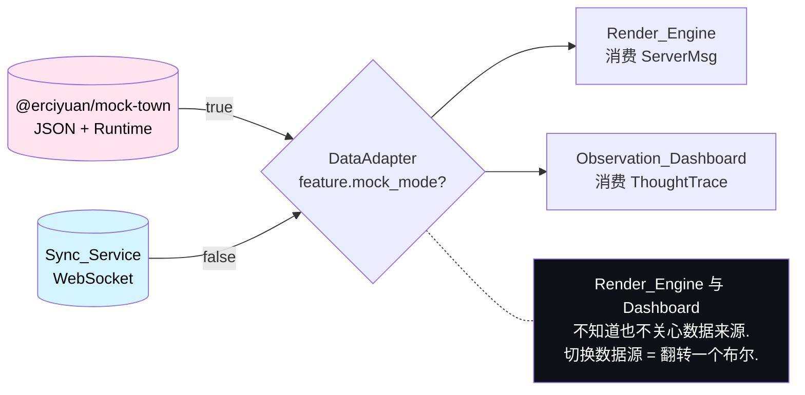

### DataAdapter 接口

前端唯一的"数据源开关"：

```ts
// src/adapter/dataAdapter.ts
export interface DataAdapter {
  subscribeTownEvents(handler: (msg: ServerMsg) => void): () => void
  getCharacters(): Promise<Character[]>
  getRecentTraces(charId: string, limit: number): Promise<ThoughtTrace[]>
  getRecentDialogues(limit: number): Promise<Dialogue[]>
  getTrends(): Promise<HotTrend[]>
}

export function createDataAdapter(mode: 'mock' | 'live'): DataAdapter {
  return mode === 'mock' ? new MockDataAdapter() : new LiveDataAdapter()
}
```

`mode` 由 `feature.mock_mode` 控制（环境变量 / URL `?mock=1` / Dashboard 设置面板里的开关三选一），整个 Render_Engine 与 Dashboard 都不知道数据来源。

### 真实数据替换路径

阶段递进：

| 阶段 | DataAdapter 模式 | 后端要求 |
|---|---|---|
| Slice 0–3 | `mock` | 不需要后端 |
| Slice 4 | `live` | 仅 Sync_Service + Town_System 内存事件总线 |
| Slice 5+ | `live` | + Agent_Core + Memory + MCP |
| 现场降级 | 一键 `mock` | 后端可整体宕机 |

**前端零改动**：只切 DataAdapter，UI 组件、Phaser Scene、Bento Grid 卡片都不动。

### 现场降级 Cookbook

| 故障 | 一键操作 | 视觉表现 |
|---|---|---|
| 后端进程整体崩溃 | 浏览器地址栏加 `?mock=1` 刷新 | 画面继续动，顶部红条 `DEGRADED MODE: mock fallback` |
| WebSocket 抖动 | DataAdapter 自动指数退避，画面期间播放 Mock | 角色继续走动，气泡照常出 |
| Phaser 加载失败 | 自动降级到"Tile 静态截图 + DOM 模拟精灵" | 至少不白屏 |
| Mock 模块加载失败 | 内置 `fallback.png` 截图 + "请重启 demo" 提示 | 仍非白屏 |

---

## Vertical Slice Delivery Plan

把 48 小时拆为 1 个零号 Slice + 8 个业务 Slice。**每个 Slice 都必须能独立 demo**，自带 fallback 数据。这是黑客松落地节奏，具体小时数由 tasks.md 估算。

```mermaid
gantt
    title Vertical Slice 时序图（Pre-Slice 资产准备 + 8 个 Slice）
    dateFormat X
    axisFormat %s
    section 资产准备
    Pre-Slice 资产管线 + Manifest    :p, 0, 1
    section UI 命脉
    Slice 0 可见小镇骨架            :s0, after p, 1
    Slice 1 会动的小镇 (Mock)        :s1, after s0, 1
    Slice 2 仪表盘骨架 (Mock)        :s2, after s1, 1
    Slice 3 扫码+角色生成入口        :s3, after s2, 1
    section 后端注水
    Slice 4 Sync_Service 替换 Mock   :s4, after s3, 1
    Slice 5 Agent_Core 脚本行为      :s5, after s4, 1
    Slice 6 Memory + MCP             :s6, after s5, 1
    Slice 7 Stretch 玩法             :s7, after s6, 1
```

### Pre-Slice — 资产准备（Asset Preparation，Tier -1，业务代码动笔之前的零号 Slice）

**目标**：在写第一行业务代码之前，按 Requirement 29「资产准备契约」全量交付类别 A–L 全部素材，并通过 `npm run check:assets` 启动校验。Pre-Slice 是后续所有 Slice 的硬前置，没有它就不开 Slice 0。

**交付物清单（按 R29 类别 A–L 全量枚举）**：

| 类别 | 来源 R29 | 必交付内容（数量下限） |
|---|---|---|
| A. Tilemap 与地图 | R29.1–5 | 1 张 64×64 `.tmj` 主地图 + 1 张主 tileset（≤ 512 KB、≥ 64 种 Tile）+ 7 个分区地标精灵（漫展拱门、Cos 反光板、谷子货架、画板、新人指引牌、限定狙击塔、电视墙）+ 公用建筑/植物 Tile 变体 ≥ 20 种；每张 Tile 在 `properties` 中标注 `collide` |
| B. 7 类萌宠资产 | R29.6–7 | 7 类 mascot_type 全套：每类 idle 立绘 + 64×64 大头照 + 4 方向 walk 各 4 帧（共 16 帧）+ 动作帧 ≥ 2 个 + persona_color + 中文 catchphrase + 罗马音 catchphrase + core_traits ≥ 3 条；命名 `mascot_{mascot_type}_{frame}.png` |
| C. NPC 精灵 | R29.8–10 | 6 类 persona_tag 各 ≥ 5 个 NPC（合计 ≥ 30 个）；每个 NPC ≥ 17 帧（idle×1 + 4 方向 walk×4）+ 姓名文案 + 口头禅文案 |
| D. 视频流 Mock | R29.11–12 | ≥ 12 条二次元视频 mock，覆盖 9 类 video_tags（Cos / 漫展 vlog / 动漫解说 / 角色分析 / 谷子开箱 / 手办 / 二次元穿搭 / 同城漫展 / 二创剪辑），每条含 thumbnail（≥ 540×960） |
| E. 测一测题库 | R29.13–14 | ≥ 15 道题，每题 7 选项 × 7 mascot_type = 49 权重；R18 给出的 3 道示例题标记为「路演必跑」 |
| F. 漫展 Mock | R29.15–17 | ≥ 6 个漫展 mock，覆盖 ≥ 3 个城市；每个漫展含 R22.2 全部 10 个字段 + 关联 ≥ 3 个视频 ID |
| G. 搭子 Mock | R29.18–20 | ≥ 20 个搭子 NPC mock；7 类 mascot_type 各 ≥ 2；每张 mock 一一关联类别 C 的 NPC sprite |
| H. 内容发布模板 | R29.21–24 | 视频脚本模板 ≥ 5 套（开头/中间/结尾三段式）+ 发布文案模板 ≥ 5 套 + 话题标签库 ≥ 10 个（含 #次元小镇 #二次元搭子 #漫展搭子 #Cos搭子）+ 合拍模板 ≥ 3 套 |
| I. UI 视觉资源 | R29.25–30 | 白底气泡 sprite（含尾巴朝下变体）+ DEGRADED MODE 红条样式 + 7 萌宠图标 + 11 搭子类型图标 + Glassmorphism 卡片背景纹理 + 异世界转生粒子贴图与背景图 ≥ 3 张 |
| J. 音效与字体 | R29.31–36 | 异世界转生音效 1 段（3–8s）+ 弹框掉落 SFX + 点击/翻页 SFX ≥ 3 段 + 萌宠生成成功 BGM + 中文像素字体（覆盖 GB2312）+ 英文/罗马音像素字体 |
| K. 同人 Mock | R29.37–38 | ≥ 5 篇同人 mock：4 篇 4 格漫画 + 1 篇短小说（≤ 400 字符），全部通过 R11 round-trip |
| L. 异常资源 | R29.39–41 | 网络断开插画 + 转生失败插画 + fallback 像素角色 + Phaser 完全跑不起来时的全镇静态截图 |

**Demo 兜底**：素材完整 + manifest 通过校验后，仅靠静态资产 + Mock 包就能跑通 Slice 0（与既有 Mock-First 兜底链路一致）；Pre-Slice 自身不写任何业务代码，所以不存在"业务代码崩溃"导致 Pre-Slice 失败的风险。

**完成度门槛（DoD）**：
1. `assets/MANIFEST.yaml` 全量登记，字段完整（path / category / hash / size_kb / license / source_url / author / required_for_demo）
2. `npm run check:assets` 退出码 0、全部断言通过（详见 Asset Pipeline 章节启动校验脚本）
3. `predev` / `prebuild` / `predemo` 钩子已配置；尝试在缺资产状态下 `npm run dev` 必然中止（验证启动校验失败立即中止的强约束，对应 R29.50–52）
4. 类别 A–L 各项数量下限均满足（由启动脚本类别检查执行）

### Slice 0 — 可见小镇骨架（Tier 0）

**交付**：Phaser 加载 64×64 Tile 地图、3 个静态角色站位、相机能拖动/缩放、首屏 ≤ 2s。

**数据源**：`@erciyuan/mock-town` 的 `tilemap` + `characters` 静态字段。

**Demo 话术**："这是我们的小镇，参考 Smallville 的俯视像素风。"

**独立 demo 兜底**：所有资源 critical path（tileset PNG + 3 个 sprite sheet）打包到 Next.js public/，离线可加载；Phaser 失败时回退到 `` 静态截图。

### Slice 1 — 会动的小镇（Tier 0–1，Mock 驱动）

**交付**：3+ 角色按 Mock `timeline` "假装走路"、按 Mock `dialogues` 弹出 Smallville 风格白底气泡、角色脚下显示 `is brewing coffee` 动作描述、相机平滑跟随。

**数据源**：`@erciyuan/mock-town` `startRuntime()` 90s 循环事件流。

**Demo 话术**："小镇里有 10 个 AI 居民，他们正在咖啡馆聊代码、在广场上拉票。"

**独立 demo 兜底**：Runtime 失败 → 切到 `traces` 静态列表逐条 setTimeout 播。

### Slice 2 — 仪表盘骨架（Tier 1，Mock 驱动）

**交付**：Bento Grid 主仪表盘 + 思维链滚动卡 + 全镇对话流侧栏 + 角色细节卡（Smallville 排版）+ 顶部 DEGRADED MODE 红条占位。

**数据源**：`@erciyuan/mock-town` 的 `traces` / `dialogues` / `characters` / `trends`（trends 仅在 Stretch flag 开时展示）。

**Demo 话术**："上帝视角的控制台，我们能实时审计每个角色的思维链。"

**独立 demo 兜底**：所有 Bento 模块独立组件，单个模块崩溃时只灰化该格，整体不挂。

### Slice 3 — 扫码 + 角色生成入口（Tier 1）

**交付**：QR 二维码生成页（仅前端 + 简易 token API）、角色生成表单（关键词+性格标签+参考图）、3–8s 异世界转生动画、生成成功后角色出现在小镇画面里。

**数据源**：MVP 走预制角色池（Character_Generator fallback 路径）；服务端 30s 超时硬规则。

**Demo 话术**："评委可以扫码进来，自己生成一个二次元角色，亲眼看到 Ta 出现在小镇里。"

**独立 demo 兜底**：表单可纯前端运行，本地 localStorage 存 character；后端不可用时仍能"演示生成流程"。

### Slice 4 — 后端注水：Sync_Service WebSocket（Tier 2）

**交付**：Sync_Service WebSocket Hub 上线，`feature.mock_mode = false`，Render_Engine + Dashboard 切到 live 数据。Town_System 仅做事件总线，不依赖 Agent_Core。

**数据源**：手动控制台 `town.publish(pos|speech)` 模拟事件，或 `MockTownRuntime` 直接喂给 Sync_Service。

**Demo 话术**："切换到真实链路，画面表现一致。"

**独立 demo 兜底**：DataAdapter 重连失败 5 次自动 `mock_mode = true`。

### Slice 5 — Agent 脚本行为（Tier 2–3）

**交付**：Agent_Core 进入 scripted 模式，Persona FSM + 模板填充驱动每个角色每 2s 产出一个 Thought_Trace。角色真的"想东西"，仪表盘真的有滚动。

**Demo 话术**："这些角色不是录像，是 AI 自己在想、在选下一步。"

**独立 demo 兜底**：单角色脚本崩溃时该角色 idle，不影响其他角色。

### Slice 6 — Memory + MCP（Tier 3）

**交付**：Memory_System 三因子检索接入 Agent_Core；MCP_Tool_Gateway 至少 2 个工具（`coffee_machine.brew`、`bulletin_board.post`）；Sandbox 进程隔离 + 资源上限。

**Demo 话术**："角色有真实的记忆库，他们能调用咖啡机、贴公告，每次工具调用都被沙盒隔离与审计。"

**独立 demo 兜底**：Memory 60s 内 ≥ 5 次失败 → 该角色暂停决策；其他角色照常。

### Slice 7+ — Stretch 玩法（Tier 4）

按以下优先级逐项启用，每项独立 feature flag：

1. **Doujin_Generator + round-trip serde**（用户点名必做的 P1，序列化 round-trip 是测试主角）
2. **Observation_Dashboard JSONL 导入导出**（P2，同样用户点名）
3. **Intervention_Interface（托梦 + 空投）**
4. **Ranking_System（厨力打榜 + 党争快照）**
5. **Goods_System + Itasha_System（虚拟谷子 + 痛房）**
6. **Live LLM 接入**（最后启用，scripted 模式始终是兜底）

每个 Stretch 模块上线前先在 Mock 包补一份对应的 mock 数据，保证哪怕该模块崩了，仪表盘对应卡片也有内容。

---

## Components and Interfaces

组件介绍顺序遵循 UI-First 原则：**主角是 Render_Engine 与 Observation_Dashboard，其他模块都是为它们注水**。

### 1. Render_Engine（前端渲染主角）[MVP]

**职责**：承载 Tilemap、角色精灵动画、对话气泡、相机控制、首屏渲染。这是评委第一眼看到的画面。

#### 1.1 Tilemap 切片资源管线

| 项 | 设计 |
|---|---|
| Tile 尺寸 | 32×32 像素，固定不变 |
| 地图尺寸 | 64×64 Tile（2048×2048 像素） |
| 资源来源 | OpenGameArt 的 LPC tileset（CC-BY-SA） + Tiled 编辑器自制覆盖层 + itch.io 二次元主题 tileset 选购 |
| 二次元化策略 | 1) 调色板替换（用 24 色限定主题色板覆写）；2) 关键 Tile（喷泉、咖啡机、招牌）手绘覆盖图（pixel-art studio 出图） |
| Tile 命名约定 | `{layer}_{biome}_{kind}_{variant}.png` 例：`floor_plaza_brick_01.png`，`prop_cafe_machine_coffee.png` |
| 输出格式 | Tiled `.tmj`（JSON Tilemap） + `tileset.png`，前端通过 Phaser `tilemap.json` 加载 |
| 体积控制 | 主 tileset ≤ 512 KB，地图 JSON ≤ 200 KB |

#### 1.2 Smallville 经典布局复刻

64×64 网格上的功能区分区（Tile 坐标，左上为原点 `(0,0)`）：

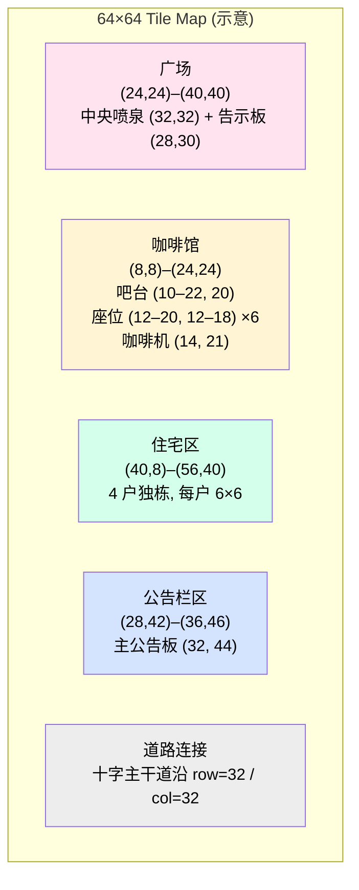

**约束**：
- 所有 Tile 区域两两不重叠；交界处用 1 Tile 宽的"过渡 Tile"。
- 阻挡 Tile（家具、建筑外墙）写入 Tilemap `properties.collide = true`，`Pathfinding_Engine` 直接读取。
- 房间内部"门"使用专门的 `door` Tile，MCP `door.open` 工具与之绑定。

#### 1.3 角色精灵规格

| 项 | 规格 |
|---|---|
| 立绘尺寸 | 32×32 像素（与 Tile 同尺寸） |
| 4 方向 walk | up / down / left / right，每方向 4 帧 → 16 帧 walk |
| idle | 单方向 2 帧呼吸动画（朝下默认） |
| 动作帧 | `brewing` / `talking` / `sleeping` / `posting`，每动作 4 帧 |
| 总帧数 | ≥ 26 帧/角色 |
| Sprite Sheet | 列方向排：row 0 = down walk, row 1 = left, row 2 = right, row 3 = up, row 4 = idle, row 5+ = 动作 |
| 帧率 | walk 8 FPS（每帧 125ms），动作帧 4 FPS |
| Manifest | `sprite.json` 描述帧索引，前端 Phaser AnimationManager 解析 |

#### 1.4 Smallville 风格对话气泡 UI

视觉规范（**评委一眼认出**的关键）：

| 项 | 值 |
|---|---|
| 形状 | 圆角矩形 + 朝下小尾巴（CSS clip-path 或 SVG） |
| 背景色 | `#FFFFFF` |
| 边框 | 2px solid `#1A1A1A`，圆角 8px |
| 阴影 | `box-shadow: 0 2px 0 rgba(0,0,0,0.25)` |
| 字体 | `Pixel Operator` / `VT323` / 中文回落 `霞鹜文楷` |
| 字号 | 12px（中文 14px） |
| 内边距 | `padding: 6px 10px` |
| 单条字数 | ≤ 80 字符（Requirement 8.2） |
| 显示时长 | 4 秒（Requirement 7.6） |
| 移除方式 | **立即移除，不淡出**（Requirement 7.6 明确） |
| 角色头顶偏移 | `translate(0, -36px)` 距离精灵中心 |
| 多角色重叠时 | 同 Tile 时按 `character_id` 字典序错位上推 12px |

实现：Phaser Scene 顶层叠加一个 React 渲染层（`PhaserBridge`），气泡使用 React 组件 + Framer Motion 弹出，避免 Phaser DOM 操作。

#### 1.5 角色脚下动作描述文本（Smallville 同款）

| 项 | 值 |
|---|---|
| 触发 | Agent_Core `next_action.kind != 'idle'` 时 |
| 文本 | `is brewing coffee` / `is talking with Hina` / `is heading to plaza` |
| 字体 | 同气泡，10px |
| 颜色 | `#1A1A1A` 半透明 0.7 |
| 位置 | 精灵下方 4px |
| 持续 | 与 next_action 持续时间一致，结束立即清除 |

#### 1.6 相机与场景控制

- **跟随相机模式**：默认跟随用户自己生成的角色；点击其他角色切换跟随。
- **自由摄像模式**：按住空格 + 拖拽，松开后慢速回到跟随。
- **缩放档位**：3 档（×1, ×1.5, ×2），鼠标滚轮切换，平滑过渡 200ms。
- **平滑滚动**：Phaser `cameras.main.startFollow(target, true, 0.08, 0.08)`，软跟随系数 0.08。
- **边界约束**：相机不越出 Tilemap 物理边界。

#### 1.7 首屏 ≤ 2s 渲染策略（Requirement 15.6 + 16.4）

Critical Path（按加载顺序）：

```
1. /tileset_main.png       (≤ 256 KB, preload tag)
2. /tilemap.tmj            (≤ 200 KB)
3. /sprite_default.png     (≤ 64 KB, 1 张 fallback 角色 sprite)
4. Phaser Scene 启动
5. 渲染 Tilemap + 1 fallback 精灵 → 视觉就绪
6. 异步加载剩余精灵 + Mock 数据
```

**优化手段**：
- Next.js `<link rel="preload">` 把上述 3 个 critical 资源提前推到浏览器
- `loading.tsx` 显示一个像素风加载条，避免白屏
- 整张地图静态首屏截图（`/og/town-static.png`）作为 LCP fallback 兜底

#### 1.8 降级渲染策略（铁律）

| 故障 | 行为 |
|---|---|
| Phaser 加载失败 | 切到"DOM 模拟模式"：`` 渲染整张 Tilemap 截图 + `<div>` 模拟精灵位置（仅 mock 模式可用） |
| sprite sheet 失败 | 用 fallback `default.png` 占位（所有角色长一样，至少不白屏） |
| Tilemap 解析失败 | 加载 `town-static.png` 整张静态图 |
| WebGL 不可用 | Phaser 切 `type: Phaser.CANVAS` |
| 浏览器不支持 | 提示页 + 静态截图 + "请用 Chrome 90+" |

**绝对铁律**：在任何一种降级模式下，画面必须**至少包含 Tile 地图 + 1 个静态精灵**。不允许白屏。

#### 1.9 Render_Engine 接口

```ts
class RenderEngine {
  init(container: HTMLDivElement, tilemapUrl: string): Promise<void>
  spawnSprite(charId: string, manifest: SpriteManifest, pos: TilePos): void
  moveSprite(charId: string, to: TilePos, durationMs: number): void
  showSpeechBubble(charId: string, text: string): void  // 4s 后立即移除
  showActionLabel(charId: string, label: string | null): void
  followCamera(charId: string | null): void
  setDegraded(reason?: string): void  // 切到 DOM 模拟或静态截图
}
```

### 2. Observation_Dashboard（仪表盘主角）[MVP]

**职责**：上帝视角控制台。Bento Grid 布局，承载思维链滚动、对话流、角色细节卡、热搜榜、JSONL 导入导出。这是评委第二眼看到、决定打分的画面。

#### 2.1 Bento Grid 精确网格

12 列 × 8 行 grid，gap 16px。各模块占据：

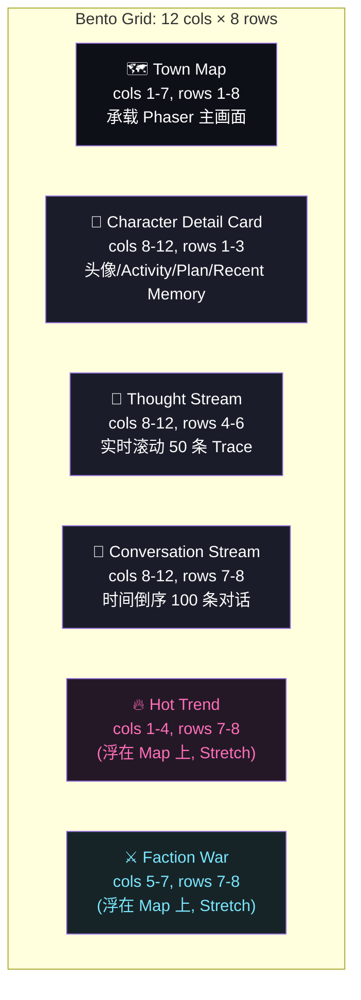

**响应式**：
- ≥ 1440px：12×8 完整布局
- 1024–1440px：Map 占满 cols 1–8，右侧栏垂直堆叠
- < 1024px：仪表盘隐藏右侧栏，Map 全屏 + 浮动 Thought Stream 折叠抽屉

#### 2.2 Glassmorphism Design Tokens

```ts
// src/theme/tokens.ts
export const theme = {
  bg: '#0E1018',                        // 主背景
  surface: 'rgba(255,255,255,0.06)',    // 卡片背景
  surfaceHover: 'rgba(255,255,255,0.10)',
  border: '1px solid rgba(255,255,255,0.12)',
  blur: 'backdrop-filter: blur(20px) saturate(140%)',
  shadow: '0 4px 24px rgba(0,0,0,0.45)',
  radius: '12px',

  text: '#F5F5F7',
  textDim: 'rgba(245,245,247,0.65)',
  textMute: 'rgba(245,245,247,0.40)',

  accentPink: '#FF6FB7',                // 二次元粉
  accentCyan: '#7AE7FF',                // 二次元青
  accentLime: '#B6FF6F',                // 成功 / goal_completed

  warn: '#FFB86F',
  danger: '#FF6F6F',                    // DEGRADED MODE 红条

  fontMono: '"JetBrains Mono", "Fira Code", monospace',
  fontPixel: '"VT323", "Pixel Operator", monospace',
  fontSans: '"Inter", "霞鹜文楷", sans-serif',
}
```

#### 2.3 24 主色色板（Requirement 15.5）

按用途分组（用于 Tile + Sprite + UI 总和不超过 24 色）：

| 组 | 颜色 |
|---|---|
| 背景层（4） | `#0E1018` `#1A1D29` `#241827` `#172427` |
| 表面层（3） | `rgba(255,255,255,0.06)` `rgba(255,255,255,0.10)` `rgba(255,255,255,0.04)` |
| 文本层（3） | `#F5F5F7` `rgba(245,245,247,0.65)` `rgba(245,245,247,0.40)` |
| 强调（3） | `#FF6FB7` `#7AE7FF` `#B6FF6F` |
| 警告（2） | `#FFB86F` `#FF6F6F` |
| 角色发色（5） | `#FFD9A8` `#A8D8FF` `#FFA8D8` `#D8A8FF` `#A8FFD8` |
| Tile 自然（4） | `#3D5A41`（草） `#7B5A3D`（土） `#9DA8B8`（石） `#D8C5A8`（木） |

**对比度**：所有文本对其背景的对比度 ≥ 4.5:1（WCAG AA），Glass 卡片上的 dim 文本 ≥ 3:1。

#### 2.4 Thought Stream 滚动组件

| 项 | 设计 |
|---|---|
| 数据 | `WebSocket subscribe('char:'+id)` 推送的 `thought` 消息 |
| 容量 | 最近 50 条，超出 FIFO |
| 单条卡片 | 高度 84px（observation 一行 + plan 一行 + next_action 标签） |
| 字段 | 时间 / observation / plan / next_action 标签 / speech（如有） |
| 标签颜色 | move=cyan, tool=pink, speak=lime, idle=mute |
| 滚动 | 新条目从顶部插入，使用 Framer Motion `layout` 平滑下移 |
| 间距 | 卡片间 8px，内边距 12px |
| 字体 | observation/plan 用 Inter 13px，timestamp/tag 用 JetBrains Mono 11px |
| 失败标 ⚠ | 当 `trace.error != null`，卡片左侧显示橙色 4px 竖线 + ⚠ icon |

#### 2.5 全镇对话流侧边栏

| 项 | 设计 |
|---|---|
| 容量 | 最近 100 条，时间倒序 |
| 单条 | 角色 A 头像 32px + `→` + 角色 B 头像 32px + 文本一行 |
| 文本超长 | 超过 60 字符截断 + `...`，hover 展开浮窗 |
| 跨角色高亮 | 当前选中角色相关对话用 `accentCyan` 左侧 3px 竖线 |
| 自动滚动 | 用户滚动时暂停自动滚动，3s 无操作恢复 |

#### 2.6 角色细节卡（Smallville 排版复刻）

复刻 Smallville 论文 demo 中的右侧面板：

```
┌────────────────────────────┐
│ [头像 64×64]   姓名         │  ← 卡片头：32px 间距
│                Persona Tag  │
├────────────────────────────┤
│ Activity                    │  ← 16px 标题 + 14px 内容
│ is brewing coffee in cafe   │
├────────────────────────────┤
│ Plan                        │
│ • 完成 morning routine      │
│ • 与 Hina 在广场会合         │
│ • 推销新写的代码 (goal)      │
├────────────────────────────┤
│ Recent Memory (Top 5)       │  ← 三因子检索 Top 5
│ 09:21 saw Hina at fountain  │
│ 09:18 thought about coffee  │
│ ...                          │
└────────────────────────────┘
```

| 项 | 值 |
|---|---|
| 卡片宽度 | 360px（cols 8–12 内） |
| 头像 | 64×64 像素，2px accentPink 边框 |
| 标题字号 | 14px / 600 weight |
| 内容字号 | 13px / 400 weight |
| 段落间距 | 12px |
| 分隔线 | 1px `rgba(255,255,255,0.08)` |

#### 2.7 JSONL 导入导出 UI

**导出按钮**：右上角浮动按钮，点击后下载 `traces-{character_id}-{ts}.jsonl`。

**导入区**：
- 拖拽区：虚线边框 + "拖拽 .jsonl 文件到此 / 或点击选择"
- 接受 `.jsonl` `.json` 后缀
- 文件大小上限 10MB
- 解析中：进度条 + 当前条数
- 解析失败：红色提示 + 错误行号 + 跳过该行的选项
- 成功：toast `导入 N 条 trace` + 自动选中导入的角色

**接口**：
```ts
GET  /api/dashboard/export?character_id=...     -> JSONL (each line = ThoughtTrace)
POST /api/dashboard/import (multipart, .jsonl)  -> { imported: number, traces: ThoughtTrace[], errors: { line: number, reason: string }[] }
```
JSONL 格式：每行一个 `ThoughtTrace`，UTF-8，行尾 `\n`。Round-trip 不变量见 Correctness Properties。

#### 2.8 DEGRADED MODE 红条（Requirement 16.5）

| 项 | 值 |
|---|---|
| 位置 | 顶部固定，z-index 9999 |
| 高度 | 36px |
| 背景 | `linear-gradient(90deg, #FF6F6F 0%, #FF8B6F 100%)` |
| 文本 | `⚠ DEGRADED MODE — {reason}`，14px / 600 weight，居中 |
| 动画 | 滑入 200ms，恢复时滑出 200ms |
| 关闭 | 不可手动关闭，仅由系统恢复事件触发 |
| 多 reason | 取最严重一条显示，hover 弹出全部列表 |

### 3. Sync_Service（WebSocket 实时同步）[MVP / Tier 2]

**职责**：广播 position / action / speech / system 事件；心跳；订阅频道；对接 DataAdapter。

**协议（JSON over WS）**：

```ts
// Server -> Client
type ServerMsg =
  | { type:'pos', char_id, x, y, frame, ts }
  | { type:'speech', char_id, text, ts }
  | { type:'action_label', char_id, label, ts }
  | { type:'thought', char_id, trace: ThoughtTrace }   // 仅 Dashboard 订阅
  | { type:'system', kind:'degraded'|'recovered'|'memory_unstable', payload }
  | { type:'heartbeat', server_ts }

// Client -> Server
type ClientMsg =
  | { type:'subscribe', channels: ('town'|'dashboard'|`char:${string}`)[] }
  | { type:'snapshot_request' }       // 重连后同步全量
  | { type:'pong' }
```

**心跳**：每 30s server → client 发 heartbeat（Requirement 7.4）。
**重连**（Requirement 7.5）：客户端指数退避（1s,2s,4s,8s,16s 上限），最多 5 次；**仅在握手成功后才请求 snapshot 并标记 recovered**（避免握手未稳就拉快照）。
**广播延迟目标**：≤ 500ms（Requirement 7.2）；20 角色压力下 ≤ 1s（Requirement 16.2）。
**与 DataAdapter 关系**：Sync_Service 输出的 `ServerMsg` 与 `@erciyuan/mock-town` 输出的事件**逐字段一致**，前端 `LiveDataAdapter` 与 `MockDataAdapter` 都向 Render_Engine + Dashboard 推送同一种消息流。

### 4. Town_System（小镇调度核心 / 事件总线）[MVP]

**职责**：全局调度（角色生命周期、地图、事件总线）、子系统协调、Feature Flag 管理。Slice 4 阶段它仅充当事件总线（直接转发 Mock Runtime 或人工触发的事件给 Sync_Service），Slice 5+ 才接入 Agent_Core。

**关键接口（内部）**：

```ts
class TownSystem {
  spawnCharacter(charId: string, pos: TilePos): void
  despawnCharacter(charId: string): void
  attachGoal(charId: string, goal: GoalSpec): void
  appendSubGoal(charId: string, goalText: string): Result<void, 'limit_reached'|'empty_text'>
  features: FeatureFlags  // { live_llm, ranking, goods, doujin, intervention, cloud_sync, mock_mode }
  bus: EventEmitter       // 'goal_completed', 'speech', 'tool_invoked', ...
}
```

### 5. Entry_Service（入口与会话）[MVP]

**职责**：QR 码生成、会话令牌签发、Session 初始化、设备指纹采集。

**关键接口**：

```ts
// HTTP
POST /api/qr/issue                 -> { token: string, qr_png_url: string, expires_at: ISO }
GET  /enter?token=...              -> 重定向到 / 并写 cookie
POST /api/session/init             -> { user_id, ws_url, server_time }

// 会话令牌：JWT，payload = { tid, exp, scope: 'demo' }
// 过期时间 MVP 固定 2 小时
```

**实现要点**：
- 令牌过期或非法 → 401 + 引导页（Requirement 1.4）
- 设备指纹采用 UA + Canvas Fingerprint 简单组合，仅作日志，不做强校验
- 并发 ≥ 50 通过 Node 单进程即可承载

### 6. Character_Generator（角色生成 / The Hook）[MVP]

**职责**：根据关键词 / 性格标签 / 参考图片生成 32×32 像素角色资产。

**关键接口**：

```ts
POST /api/character/generate
Request:
  {
    keywords?: string,
    persona_tags?: PersonaTag[],   // 'tsundere'|'yandere'|'tennen'|'chuuni'|'sanmu'|'hara_guro'
    reference_image?: base64,
    user_id: string
  }
Response:
  {
    character_id: string,
    name: string,
    sprite: { idle: url, walk: { up,down,left,right: url[] } },
    persona_profile: PersonaProfile,  // JSON
    fallback: boolean
  }
```

**实现策略（MVP）**：
1. **预制角色池**：项目内置 ≥ 30 个手绘像素角色，按 `persona_tags` 索引
2. **关键词模板**：`name = 模板("${kw1}的${persona}少女")`，随机化发色/瞳色调色板
3. **参考图色彩提取**：仅取主色（k-means k=3）作为发/瞳/服饰主色，叠加到预制底版
4. **生成超时 30s** → 直接从预制池随机抽取并 `fallback=true`（Requirement 2.6）
5. **异世界转生动画**：前端独立组件，固定 3–8 秒，覆盖后端生成延迟（Requirement 2.5）

**Stretch**：接入 Stable Diffusion + ControlNet 像素化后处理。

**异世界转生动画分镜**（前端独立组件，无需后端配合）：

| 帧 | 时长 | 内容 |
|---|---|---|
| 1 | 0–500ms | 全屏白闪 + "♪♪♪" 音效占位 |
| 2 | 500–2000ms | 二次元粒子聚拢成角色轮廓（Framer Motion + canvas） |
| 3 | 2000–4500ms | 角色立绘渐显 + 姓名 typewriter + persona tag 飘字 |
| 4 | 4500–6000ms | 角色"咻"地飞入 Tile 地图，相机跟随到落点 |
| 5 | 6000–7500ms | 角色第一个气泡 "我来到这个世界了！" + 异世界转生 BGM 渐弱 |

### 7. Agent_Core（大脑）[MVP scripted; Stretch live LLM]

**职责**：每个智能体的决策循环；产出 Thought_Trace；选择 next_action。

**决策循环**（默认 2 秒一拍）：

```
loop:
  observation = collectObservations(charId)            // 视野内事件 + 收件箱
  topK = Memory.retrieve(charId, observation, K=8)     // 三因子检索
  trace = generateTrace(persona, goal, topK, observation)
  Memory.write(observation, importance=auto)
  Memory.write(trace.plan, importance=auto)
  dispatch(trace.next_action)                          // move / tool / speak / idle
```

**两种模式**：

| 模式 | 触发 | 实现 |
|---|---|---|
| Scripted（MVP） | `feature.live_llm == false` | Persona 模板 + FSM；状态：idle→seek_goal→navigate→interact→reflect；单次生成 ≤ 200ms（Requirement 4.2） |
| Live LLM（Stretch） | `feature.live_llm == true` | 调 LLM_Adapter；速率限制 1 次/10s/角色（Requirement 4.3）；超时/解析失败回落 Scripted（Requirement 4.7） |

**Thought_Trace Schema（两种模式共享）**：

```ts
type ThoughtTrace = {
  trace_id: string
  character_id: string
  ts: number
  observation: string       // 自然语言
  plan: string              // 自然语言
  next_action: Action       // 结构化
  speech: string | null
  error?: string            // 仅在降级时填充
}

type Action =
  | { kind: 'move', target: TilePos }
  | { kind: 'tool', name: string, args: Record<string,unknown> }
  | { kind: 'speak', target_char: string, text: string }
  | { kind: 'idle', duration_ms: number }
```

**冲突仲裁**（Requirement 4.6）：同一 Tile 多角色想发起对话时，按 `(character_id 字典序, trace.ts)` 选定唯一发起者。

### 8. Pathfinding_Engine（小脑）[MVP]

**职责**：A* 寻路、避障、动作帧切换；不调用 LLM。

```ts
class PathfindingEngine {
  plan(from: TilePos, to: TilePos, blockers: Set<TileKey>): TilePos[]   // 50ms 硬上限
  step(charId: string): { newPos: TilePos, frame: 'walk_l'|'walk_r'|... }
}
```

- 地图最小 64×64 Tile，坐标 (x,y) 整数
- 启发式：曼哈顿距离；权重表内置门、家具阻挡 Tile
- 单次 plan 实测 < 5ms（64×64 网格）

### 9. Memory_System（记忆流 + 向量索引）[MVP]

**职责**：四类记忆（observation / dialogue / action / reflection）的写入、检索、反思触发。

**关键接口**：

```ts
class MemorySystem {
  write(charId: string, e: MemoryInput): Promise<MemoryEntry>          // ≤ 200ms
  retrieve(charId: string, query: string, k: number = 8): Promise<MemoryEntry[]>
  reflectIfNeeded(charId: string): Promise<Reflection | null>          // Stretch
  exportTraces(charId: string): JSONL
  importTraces(content: JSONL): ThoughtTrace[]
}

type MemoryInput = {
  type: 'observation'|'dialogue'|'action'|'reflection'|'dream'
  text: string
  importance?: number          // 1-10；auto 时由模板规则打分
  links?: string[]             // 关联其他记忆 id
}
```

**三因子检索**（Generative Agents 范式）：

```
score = w_recency * recency(t) + w_importance * importance/10 + w_relevance * cos(emb_q, emb_e)
recency(t) = 0.99 ^ (now - t in minutes)
默认权重 (w_r, w_i, w_v) = (1.0, 1.5, 1.0)
```

**Embedding（MVP 简化）**：使用 `@xenova/transformers` 本地 MiniLM (384 维) 或纯哈希 BoW 向量；Stretch 切换到云端 embedding API。

**Reflection（Stretch）**：当未反思 importance 累计 > 150，挑选近 N 条记忆送入"反思模板"生成 1–3 条高层洞察，importance ∈ [7,10]。

**健康监测**（Requirement 5.7）：滚动窗口 60s，若写入失败 ≥ 5 或检索 P95 > 2s → `Town.bus.emit('memory_unstable')` → 暂停受影响角色决策循环 + 仪表盘红条。

### 10. MCP_Tool_Gateway（协议化工具网关）[MVP 2 tools; Stretch full set]

**职责**：以 MCP 协议向 Agent_Core 暴露小镇可交互对象；Schema 校验；调用日志；沙盒派发。

**MVP 工具清单**：

| 工具名 | input_schema | 行为 |
|---|---|---|
| `coffee_machine.brew` | `{ machine_id: string, recipe?: 'latte'\|'espresso' }` | 角色站位 + 占用 2s + 写一条 action 记忆 |
| `bulletin_board.post` | `{ board_id: string, content: string(≤140) }` | 写一条公告记忆，全镇可见 |

**Stretch 工具**：`door.open`、`shop.purchase`、`goods_shelf.inspect`、`ranking_board.vote`、`itasha.decorate`。

**调用流程**：

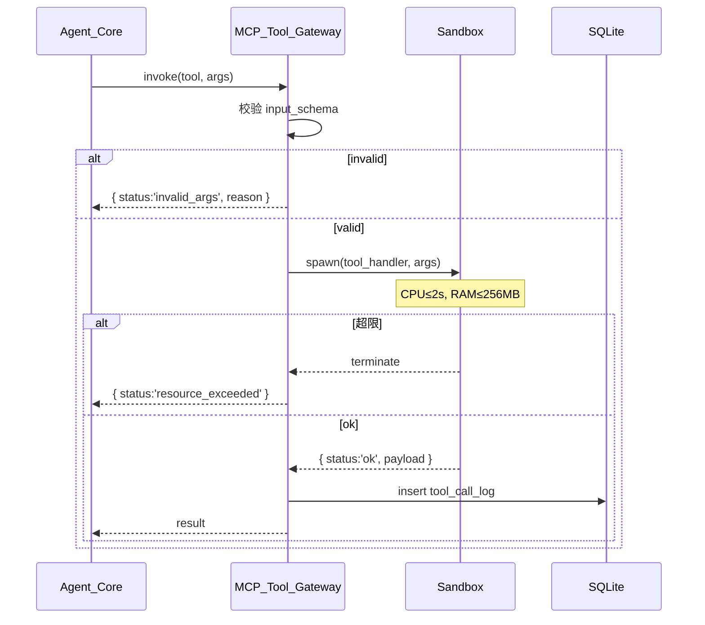

### 11. Sandbox（隔离执行）[MVP basic]

**职责**：MCP 工具调用进程隔离 + 资源上限（CPU 2s / RAM 256MB）。

**实现**：
- MVP：Node `child_process.fork` + `--max-old-space-size=256`；用 setTimeout 强杀超 2s 子进程
- Stretch：替换为 Docker `--cpus=0.5 --memory=256m --network=none`

**安全边界**：宿主进程不直接访问工具内部状态（Requirement 14.1）；所有 IO 通过 IPC JSON 消息。

### 12. Stretch 子系统

#### 12.1 Ranking_System（厨力打榜）

```ts
type PopularityEvent = { from_char, to_char_oshi, kind:'recommend', ts, dialogue_id }
class RankingSystem {
  onAffinityChange(...): void           // 监听 dialogue 结束
  topN(n=10): Array<{character_id, score, trend}>
  detectFactionWar(): FactionSnapshot   // 每 10 分钟
}
```
**反刷榜**：同一 (A, B) 对在 5 分钟内 > 3 次 recommend → 忽略（Requirement 9.4）。

#### 12.2 Goods_System + Itasha_System

- 预置 ≥ 12 SKU（徽章/立牌/抱枕 各 ≥ 4）
- 钱包：`wallet(user_id, coin)`；打工 `+1..5 coin`
- 痛房：`room(user_id, layout: ItashaTile[8][8])`；只读公开
- 售罄：`status='sold_out'` 不扣币（Requirement 10.6）

#### 12.3 Doujin_Generator（同人二创）

- 触发：跨 IP persona 相遇 + |Δaffinity| > 5
- 产物：4 格漫画（4 张拼接像素 + ≤30 字符/格对白）或 ≤400 字符轻小说
- 内容安全：黑名单关键词过滤 → `reason='content_filtered'` 丢弃
- **Round-trip 序列化**（Requirement 11.6, 11.7）：
  ```ts
  function serializeDoujin(d: Doujin): string   // 紧凑 JSON
  function deserializeDoujin(s: string): Doujin
  // 不变量见 Correctness Properties
  ```

#### 12.4 Intervention_Interface（托梦/空投）

- 托梦：≤ 100 字符 → importance=10 记忆条目
- 速率：3 次/分钟/用户 → 超限 `rate_limit_exceeded`
- 空投：从用户库存选一件 → 落点广播动画
- 非自有角色 → `forbidden` + audit log

---

## Asset Pipeline

本节是 **Pre-Slice（资产准备）的可执行设计文档**，把 Requirement 29「资产准备契约」落到目录结构、manifest schema、生产管线、AI 兜底 prompt、启动校验脚本与降级映射六个层面。该章节回答的核心问题是：**team 怎么知道该做什么、做到什么程度、怎么校验、做不到时怎么兜底**。

资产管线与 Mock-First Pipeline 的关系：Asset Pipeline 负责"硬资产"（图、音、字、Tilemap、视频缩略图），Mock-First Pipeline 负责"软数据"（视频流文案、漫展卡片字段、搭子 mock）。两者通过同一个 npm 工作区包 `@erciyuan/mock-town` 协作：硬资产作为静态文件被打包、软数据作为 TS/JSON 模块被前端与 Sync_Service 共同 import。

### 1. 资产目录结构（assets/ 树）

```
assets/
├── MANIFEST.yaml                    # 单一事实来源（启动校验入口）
├── tilemap/
│   ├── town_64x64.tmj              # 主地图（64×64 Tile）
│   ├── tileset_main.png            # 主 tileset（≥ 64 种 Tile，≤ 512 KB）
│   └── landmarks/                  # R25 7 大功能区地标精灵
│       ├── convention_arch.png        # 漫展拱门 → Convention_Plaza
│       ├── cos_studio_reflector.png   # Cos 反光板 → Cos_Studio
│       ├── goods_shelf.png            # 谷子货架 → Goods_Bazaar
│       ├── doujin_easel.png           # 画板 → Doujin_Atelier
│       ├── newbie_signpost.png        # 新人指引牌 → Newbie_Lobby
│       ├── limited_sniper_tower.png   # 限定狙击塔 → Limited_Info_House
│       └── buzz_tv_wall.png           # 电视墙 → Buzz_Square
├── mascots/                         # 7 类萌宠（每类一个目录）
│   ├── cat_lore/                       # 考据猫 Neko-ko
│   │   ├── idle.png                       # 32×32 立绘
│   │   ├── portrait_64.png                # 64×64 大头照（结果页 + 搭子卡片）
│   │   ├── walk_down_01..04.png           # 4 帧
│   │   ├── walk_up_01..04.png
│   │   ├── walk_left_01..04.png
│   │   ├── walk_right_01..04.png
│   │   └── action_brewing_01..04.png      # ≥ 1 个动作（≥ 2 帧）；类别 B 要求 ≥ 2 个动作
│   ├── dog_social/                     # 扩列犬 Wan-kyun
│   ├── hamster_hoard/                  # 囤囤鼠 Ham-guu
│   ├── fox_create/                     # 太太狐 Fox-sensei
│   ├── slime_newbie/                   # 云仔 Slime-mo
│   ├── wolf_limited/                   # 限定狼 Lone-wolf
│   └── pigeon_buzz/                    # 咕咕鸽 Pigeon-nya
├── npc/                             # 6 类 persona × 5 NPC = ≥ 30 NPC（≥ 510 帧）
│   ├── tsundere/                       # 傲娇
│   │   ├── 01/{idle.png, walk_down_01..04.png, walk_up_01..04.png, walk_left_01..04.png, walk_right_01..04.png}
│   │   ├── 02/...
│   │   ├── 03/...
│   │   ├── 04/...
│   │   └── 05/...
│   ├── yandere/                        # 病娇
│   ├── tennen/                         # 天然呆
│   ├── chuuni/                         # 中二病
│   ├── sanmu/                          # 三无
│   └── hara_guro/                      # 腹黑
├── ui/
│   ├── speech_bubble.svg               # Smallville 风白底气泡（含尾巴朝下变体）
│   ├── degraded_banner.svg             # DEGRADED MODE 红条
│   ├── icons_mascot/                   # 7 类萌宠图标（用于 Bento Grid）
│   │   ├── cat_lore.svg
│   │   ├── dog_social.svg
│   │   ├── hamster_hoard.svg
│   │   ├── fox_create.svg
│   │   ├── slime_newbie.svg
│   │   ├── wolf_limited.svg
│   │   └── pigeon_buzz.svg
│   ├── icons_companion/                # 11 类搭子图标
│   │   ├── convention.svg              # 漫展搭子
│   │   ├── cos.svg                     # Cos 搭子
│   │   ├── photo.svg                   # 拍照搭子
│   │   ├── booth.svg                   # 逛摊搭子
│   │   ├── goods.svg                   # 买谷搭子
│   │   ├── same_ip.svg                 # 同作品搭子
│   │   ├── same_city.svg               # 同城二次元搭子
│   │   ├── duet.svg                    # 视频合拍搭子
│   │   ├── newbie.svg                  # 新手求带搭子
│   │   ├── limited.svg                 # 抢限定搭子
│   │   └── doujin.svg                  # 二创搭子
│   ├── glass_texture.png               # Glassmorphism 背景纹理
│   └── isekai_particles/               # 异世界转生粒子贴图与背景
│       ├── p01.png
│       ├── p02.png
│       └── p03.png
├── audio/
│   ├── isekai_jingle.mp3               # 异世界转生音效（3-8s，与 R2.5 转生动画时长匹配）
│   ├── popup_drop.mp3                  # 弹框掉落 SFX（Page_VideoFeed）
│   ├── click_01.mp3                    # 点击/翻页 SFX（≥ 3 段）
│   ├── click_02.mp3
│   ├── click_03.mp3
│   └── mascot_born_bgm.mp3             # 萌宠生成成功 BGM
├── fonts/
│   ├── pixel_zh.ttf                    # 中文像素字体（覆盖 GB2312）
│   └── pixel_en_romaji.ttf             # 英文/罗马音像素字体
├── fallback/                        # 异常场景资源（降级时必须可见）
│   ├── network_disconnected.png        # 网络断开提示插画
│   ├── isekai_failed.png               # 转生失败提示插画
│   ├── fallback_character.png          # fallback 像素角色（与 R2.6 fallback=true 共用）
│   └── town_static_snapshot.png        # Phaser 完全跑不起来时的全镇静态截图
└── mock-town/                       # @erciyuan/mock-town npm 包源码（软数据）
    ├── package.json                    # name: "@erciyuan/mock-town"
    ├── src/
    │   ├── index.ts                    # 统一导出
    │   ├── videos.ts                   # ≥ 12 视频 mock（含 9 类 video_tags）
    │   ├── conventions.ts              # ≥ 6 漫展 mock（≥ 3 城市）
    │   ├── companions.ts               # ≥ 20 搭子 mock（7 类 mascot_type 各 ≥ 2）
    │   ├── doujins.ts                  # ≥ 5 同人 mock（4 篇漫画 + 1 篇短小说）
    │   ├── quizzes.ts                  # ≥ 15 题（每题 7 选项 × 7 mascot_type 权重）
    │   └── publish_templates.ts        # ≥ 5 视频脚本模板 + ≥ 5 发布文案 + ≥ 10 话题标签 + ≥ 3 合拍模板
    └── README.md
```

**约束**：
- `assets/` 是仓库根目录下的真实文件夹（与 `app/`、`packages/` 同级）
- 单文件大小：tileset ≤ 512 KB（R29.2）、视频 thumbnail ≥ 540×960（R29.11）、portrait_64 ≥ 64×64（R29.6）
- 命名规范：`mascot_{mascot_type}_{frame}.png`（R29.7）、`{npc_persona}_{nn}/{frame}.png`、`speech_bubble.svg` 等可被 manifest 唯一定位

### 2. MANIFEST.yaml schema 与样例

`assets/MANIFEST.yaml` 是 Asset Pipeline 的**单一事实来源**。所有素材必须在此登记后才视为"已交付"。

**Schema**：

```yaml
version: 1                            # int，schema 版本
generated_at: <ISO 8601>              # 生成时间，便于审计
total_count: <int>                    # 资产总数
total_size_kb: <int>                  # 资产总大小（KB）
assets:                               # 资产数组，每项一个 AssetEntry
  - path: <相对 assets/ 的路径>
    category: <tilemap|mascot|npc|ui|audio|font|fallback|mock>
    hash: sha256:<hex>                # sha256 of file content；用于版本审计
    size_kb: <int>                    # 实际文件大小（KB）
    license: <CC0|CC-BY|CC-BY-SA|SELF>
    source_url: <string|"">           # 第三方来源 URL；team 自制为空字符串
    author: <string>                  # 作者署名；team 自制写 "anime-agent-town team"
    required_for_demo: <bool>         # 是否路演必跑（缺它就 fatal）
    # 类别专属字段（可选，按 category 决定）
    mascot_type?: <cat_lore|dog_social|...|pigeon_buzz>
    frame?: <idle|portrait_64|walk_down_01|action_brewing_01|...>
    persona_tag?: <tsundere|yandere|tennen|chuuni|sanmu|hara_guro>
    npc_index?: <int>                 # NPC 在某 persona 下的序号（01..05）
    landmark_for_zone?: <Convention_Plaza|Cos_Studio|...|Buzz_Square>
```

**样例条目**（覆盖每个类别的代表）：

```yaml
version: 1
generated_at: 2026-05-16T00:00:00Z
total_count: 642
total_size_kb: 8240
assets:
  - path: tilemap/tileset_main.png
    category: tilemap
    hash: sha256:abc1234def5678...
    size_kb: 412
    license: CC0
    source_url: https://opengameart.org/content/lpc-tile-atlas
    author: Foozle (LPC contributor)
    required_for_demo: true

  - path: tilemap/town_64x64.tmj
    category: tilemap
    hash: sha256:11aabbccdd...
    size_kb: 158
    license: SELF
    source_url: ""
    author: anime-agent-town team
    required_for_demo: true

  - path: tilemap/landmarks/convention_arch.png
    category: tilemap
    hash: sha256:...
    size_kb: 24
    license: SELF
    source_url: ""
    author: anime-agent-town team
    required_for_demo: true
    landmark_for_zone: Convention_Plaza

  - path: mascots/cat_lore/idle.png
    category: mascot
    mascot_type: cat_lore
    frame: idle
    hash: sha256:...
    size_kb: 18
    license: SELF
    source_url: ""
    author: anime-agent-town team
    required_for_demo: true

  - path: mascots/cat_lore/portrait_64.png
    category: mascot
    mascot_type: cat_lore
    frame: portrait_64
    hash: sha256:...
    size_kb: 22
    license: SELF
    source_url: ""
    author: anime-agent-town team
    required_for_demo: true

  - path: npc/tsundere/01/idle.png
    category: npc
    persona_tag: tsundere
    npc_index: 1
    frame: idle
    hash: sha256:...
    size_kb: 16
    license: SELF
    source_url: ""
    author: anime-agent-town team
    required_for_demo: true

  - path: ui/speech_bubble.svg
    category: ui
    hash: sha256:...
    size_kb: 3
    license: SELF
    source_url: ""
    author: anime-agent-town team
    required_for_demo: true

  - path: ui/icons_mascot/cat_lore.svg
    category: ui
    hash: sha256:...
    size_kb: 2
    license: SELF
    source_url: ""
    author: anime-agent-town team
    required_for_demo: true

  - path: ui/icons_companion/convention.svg
    category: ui
    hash: sha256:...
    size_kb: 2
    license: SELF
    source_url: ""
    author: anime-agent-town team
    required_for_demo: true

  - path: audio/isekai_jingle.mp3
    category: audio
    hash: sha256:...
    size_kb: 96
    license: CC-BY
    source_url: https://freesound.org/people/.../sounds/12345/
    author: freesound contributor
    required_for_demo: true

  - path: fonts/pixel_zh.ttf
    category: font
    hash: sha256:...
    size_kb: 1840
    license: CC-BY
    source_url: https://www.maoken.com/freefonts/...
    author: 猫啃网
    required_for_demo: true

  - path: fallback/town_static_snapshot.png
    category: fallback
    hash: sha256:...
    size_kb: 380
    license: SELF
    source_url: ""
    author: anime-agent-town team
    required_for_demo: true

  - path: mock-town/src/videos.ts
    category: mock
    hash: sha256:...
    size_kb: 12
    license: SELF
    source_url: ""
    author: anime-agent-town team
    required_for_demo: true
```

### 3. 素材生产管线（4 条并行车道）

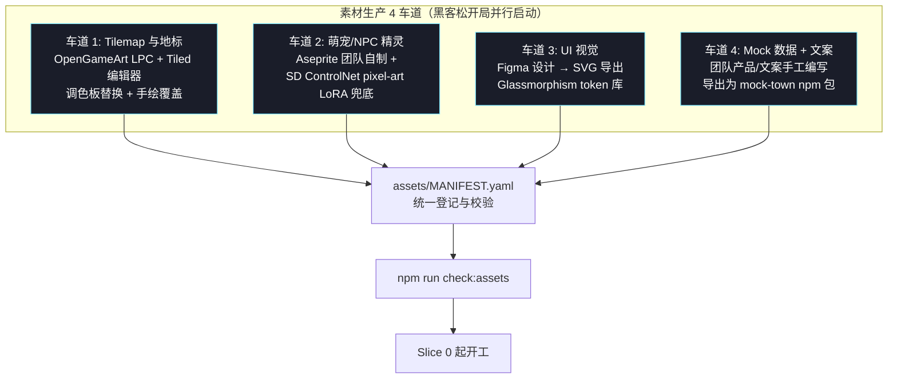

**4 条车道的具体输入输出**：

| 车道 | 工具链 | 输入 | 输出 | 负责人定位 |
|---|---|---|---|---|
| 1. Tilemap 与地标 | OpenGameArt LPC tileset（CC-BY-SA）+ Tiled 编辑器 + Photoshop/Aseprite | 24 主色板 + Smallville 布局参考 | `tilemap/*.tmj`、`tileset_main.png`、`landmarks/*.png` | Tile 美术 + 关卡设计 |
| 2. 萌宠/NPC 精灵 | Aseprite（首选）+ SD ControlNet pixel-art LoRA（兜底）| 7 类 mascot 设定文档 + 6 类 persona 文档 | `mascots/{type}/*.png`、`npc/{persona}/{nn}/*.png` | 角色美术（团队不足时切兜底） |
| 3. UI 视觉 | Figma + Glassmorphism token 库 + SVG 导出 | 已确定的 24 主色板 + Bento Grid 规范 | `ui/*.svg`、`ui/icons_mascot/*`、`ui/icons_companion/*`、`ui/glass_texture.png` | UI 设计师 |
| 4. Mock 数据 + 文案 | TypeScript + 手工编写 + JSON | 9 类 video_tags 列表 + 6 漫展城市 + 11 搭子类型 | `mock-town/src/*.ts` | 产品 + 文案 |

**车道间约束**：
- 车道 1 必须在车道 2 之前 freeze 调色板（24 主色），否则精灵与地图色调不和
- 车道 4 输出的 mock 数据中，`thumbnail_url` 字段必须指向车道 1/2 已存在的资产
- 4 条车道每天合并一次到 `MANIFEST.yaml`，避免 hash 冲突

### 4. AI 生图 prompt 模板（车道 2 兜底通道）

当团队美术产能不足时，使用 SD（Stable Diffusion）+ ControlNet pixel-art LoRA 生成精灵；产物经后处理流程切回 Aseprite 手工修正。**禁止直接交付 SD 生成图**。

#### 4.1 萌宠精灵 prompt 范式

| mascot_type | Prompt |
|---|---|
| cat_lore（考据猫） | `pixel art, 32x32, top-down, scholarly cat anime mascot wearing round glasses, holding scroll, deep purple coat, sharp expression, transparent bg, lpc style, 4-direction walk sheet, crisp pixel edges, 24-color limited palette` |
| dog_social（扩列犬） | `pixel art, 32x32, top-down, energetic shiba dog mascot waving, bright orange jacket, open mouth smile, transparent bg, lpc style, 4-direction walk sheet, crisp pixel edges, 24-color limited palette` |
| hamster_hoard（囤囤鼠） | `pixel art, 32x32, top-down, plump hamster mascot hugging stack of acorns and badges, beige fur, sleepy half-closed eyes, transparent bg, lpc style, 4-direction walk sheet, 24-color limited palette` |
| fox_create（太太狐） | `pixel art, 32x32, top-down, elegant fox mascot wearing artist apron, holding paintbrush, white-tipped tail, calm focused expression, transparent bg, lpc style, 4-direction walk sheet, 24-color limited palette` |
| slime_newbie（云仔） | `pixel art, 32x32, top-down, soft pastel-blue slime mascot with sparkly eyes, wobbling body, transparent bg, lpc style, 4-direction walk sheet, 24-color limited palette` |
| wolf_limited（限定狼） | `pixel art, 32x32, top-down, sharp lone wolf mascot in dark navy jacket, holding limited badge, alert ears, neon cyan eyes, transparent bg, lpc style, 4-direction walk sheet, 24-color limited palette` |
| pigeon_buzz（咕咕鸽） | `pixel art, 32x32, top-down, lively pigeon mascot holding microphone with antenna, gradient pink-white feathers, excited beak open, transparent bg, lpc style, 4-direction walk sheet, 24-color limited palette` |

#### 4.2 Tilemap 区域地标 prompt 范式

每个 R25 分区一条 prompt：

| 分区 | Prompt |
|---|---|
| Convention_Plaza（漫展拱门） | `pixel art, 64x64, top-down, festival arch with anime con banners, pink-cyan ribbons, glowing lanterns, soft idol-pop atmosphere, 24-color palette, transparent bg` |
| Cos_Studio（Cos 反光板） | `pixel art, 64x64, top-down, photo studio reflector and ring light setup, soft white reflector disc, magenta backdrop, 24-color palette, transparent bg` |
| Goods_Bazaar（谷子货架） | `pixel art, 64x64, top-down, anime merch shelf packed with badges acrylic standees and plushies, warm wooden shelves, price tags, 24-color palette, transparent bg` |
| Doujin_Atelier（画板） | `pixel art, 64x64, top-down, artist easel with sketchpad and ink bottles, soft purple fabric backdrop, scattered scrolls, 24-color palette, transparent bg` |
| Newbie_Lobby（新人指引牌） | `pixel art, 64x64, top-down, friendly wooden signpost with pastel arrows pointing to multiple anime zones, cute slime sticker on top, 24-color palette, transparent bg` |
| Limited_Info_House（限定狙击塔） | `pixel art, 64x64, top-down, watchtower with neon countdown screen and holographic map of limited drops, dark navy panels, cyan trim, 24-color palette, transparent bg` |
| Buzz_Square（电视墙） | `pixel art, 64x64, top-down, multi-screen led tv wall showing anime hot trends, pigeon mascot holding microphone in front, vibrant magenta-cyan glow, 24-color palette, transparent bg` |

#### 4.3 后处理流程（SD 输出 → 入库）

```
SD 输出 PNG (512×512)
  ↓ palette quantize（≤ 24 主色，使用 Aseprite 的 "Apply palette"）
  ↓ resize bilinear → nearest（缩到 32×32 或 64×64，nearest 保留像素硬边）
  ↓ padding 补齐到 32×32 网格（透明边对齐）
  ↓ Aseprite 手工修正（修发丝、修瞳孔、修服饰边缘）
  ↓ 导出 PNG（含透明通道、行扫描）
  ↓ 写入 MANIFEST.yaml（license: SELF；source_url: 写明 SD prompt 与基础模型版本以备审计）
```

**License 规则**：SD 生成 + 团队后处理 ≥ 50% 的产物登记为 `license: SELF`，并在 `source_url` 字段填 prompt + base model name 用于审计。

### 5. 启动校验脚本（scripts/check-assets.ts）

启动校验是 R29.50–52 的硬约束实现。**校验失败必须立即中止**，避免 demo 当天发现缺资产。

#### 5.1 脚本职责（伪代码）

```ts
// scripts/check-assets.ts
import yaml from 'js-yaml'
import fs from 'fs'
import path from 'path'
import crypto from 'crypto'

async function main() {
  // 1. 加载 assets/MANIFEST.yaml
  const manifestPath = path.resolve('assets/MANIFEST.yaml')
  if (!fs.existsSync(manifestPath)) fatal('MANIFEST.yaml 不存在')
  const manifest = yaml.load(fs.readFileSync(manifestPath, 'utf-8'))

  // 2. for each asset：文件存在 + hash 匹配 + license 非空 + size 合理
  for (const a of manifest.assets) {
    const abs = path.resolve('assets', a.path)
    if (!fs.existsSync(abs)) fatal(`asset missing: ${a.path}`)

    const buf = fs.readFileSync(abs)
    const actualSizeKb = Math.round(buf.length / 1024)
    if (Math.abs(actualSizeKb - a.size_kb) > 4) warn(`${a.path} size mismatch: manifest=${a.size_kb} actual=${actualSizeKb}`)
    if (actualSizeKb > 1024) fatal(`${a.path} 单文件 > 1MB`)

    // strict mode（CI / predemo）：hash 必须一致
    if (process.env.STRICT_HASH === 'true') {
      const actualHash = 'sha256:' + crypto.createHash('sha256').update(buf).digest('hex')
      if (actualHash !== a.hash) fatal(`${a.path} hash mismatch`)
    }

    if (!a.license) fatal(`${a.path} 缺 license`)
    if (a.license !== 'SELF' && !a.source_url) fatal(`${a.path} 第三方资产缺 source_url`)
  }

  // 3. required_for_demo 必须全部存在（已被步骤 2 覆盖）

  // 4. 类别下限检查（R29 数量契约）
  assert.equal(countByCategory('mascot', byMascotType).typesCovered.size, 7, 'mascot 7 类必须齐全')
  assert.greaterEq(countByCategory('npc').total, 30, 'NPC ≥ 30')
  assert.equal(countByCategory('npc', byPersonaTag).typesCovered.size, 6, 'NPC 6 类 persona 必须齐全')
  assert.greaterEq(countLandmarks(), 7, '7 大功能区地标必须齐全')
  assert.greaterEq(countMockVideos(), 12, '视频 mock ≥ 12')
  assert.greaterEq(countMockConventions(), 6, '漫展 mock ≥ 6')
  assert.greaterEq(countMockCompanions(), 20, '搭子 mock ≥ 20')
  assert.greaterEq(countMockQuizzes(), 15, '题库 ≥ 15')
  assert.equal(countMascotIcons(), 7, '萌宠图标 7 张必须齐全')
  assert.equal(countCompanionIcons(), 11, '搭子图标 11 张必须齐全')

  // 5. 总包体积检查
  const totalKb = manifest.assets.reduce((s, a) => s + a.size_kb, 0)
  if (totalKb > 50 * 1024) fatal(`总包体积 ${(totalKb/1024).toFixed(1)}MB > 50MB`)

  // 6. 退出
  console.log('✅ check:assets passed')
  process.exit(0)
}

function fatal(msg: string): never { console.error('❌', msg); process.exit(1) }
function warn(msg: string)         { console.warn('⚠', msg) }

main().catch(e => fatal(String(e)))
```

#### 5.2 package.json scripts 钩子

```json
{
  "scripts": {
    "check:assets": "tsx scripts/check-assets.ts",
    "check:assets:strict": "STRICT_HASH=true tsx scripts/check-assets.ts",
    "predev": "npm run check:assets",
    "prebuild": "npm run check:assets",
    "predemo": "npm run check:assets:strict"
  }
}
```

通过 `predev` / `prebuild` / `predemo` 钩子让"启动校验失败立即中止"成为强制约束（对应 R29.50–52）。`predemo` 启用 strict 模式（hash 必须一一匹配），保证现场素材未被改动。

### 6. 降级素材链路（与既有 Error Handling 矩阵协同）

把既有 Error Handling 中"Phaser 加载失败 / Tilemap 解析失败 / Mock 包加载失败"等故障路径与具体 fallback 资产路径绑定，使 fallback 路径变成可执行而非只是文字描述。

| 故障 | 兜底资产路径 | 加载方式 |
|---|---|---|
| Phaser 完全跑不起来（WebGL 不可用 + Canvas 也失败） | `assets/fallback/town_static_snapshot.png` | `` 全屏铺开（DOM 模拟模式终极兜底） |
| Tilemap 解析失败（.tmj 格式损坏） | `assets/fallback/town_static_snapshot.png` | `` 全屏铺开 |
| Sprite sheet 加载失败 | `assets/fallback/fallback_character.png` | 替换全部精灵纹理；与 R2.6 fallback=true 共用此资产 |
| 网络断开（fetch 全部失败） | `assets/fallback/network_disconnected.png` | 居中浮层 + DEGRADED MODE 红条 |
| 转生动画资源缺失（粒子贴图加载失败） | `assets/fallback/isekai_failed.png` | 占位 + 跳过粒子动画，继续到角色出现 |
| Mock 包加载失败 | `assets/fallback/town_static_snapshot.png` + `assets/fallback/fallback_character.png` | 二者组合，仍非白屏 |

**铁律**：所有 fallback 资产 `required_for_demo: true`，缺一即 `check:assets` fail。

### 7. 与 Mock-First Pipeline 的关系（明确接缝）

- `assets/mock-town/` 目录是 npm 工作区包 `@erciyuan/mock-town` 的源码所在；按 `package.json#main` 输出 `dist/`
- 该包构建产物 `dist/` 同时被 Next.js 前端（Render_Engine + Observation_Dashboard）和 Sync_Service（live 模式下用作 fixture）引用
- mock 数据 schema 与 Sync_Service 输出的 `ServerMsg` 类型在 `packages/types/` 中共享导出，避免双份类型定义漂移
- 软数据（视频流文案、漫展卡片字段、搭子 mock）变更要求：
  1. 更新 `assets/mock-town/src/*.ts`
  2. 同步升级 `package.json` 的 minor 版本（R29.58）
  3. 重新计算 hash 并更新 `MANIFEST.yaml`
  4. 跑 `npm run check:assets` 验证通过
- 任何破坏性 schema 变更（例：新增必填字段、重命名字段）必须在 `packages/types/` 与所有 consumer 同 PR 升级，否则 CI 拒绝合并

---

## Data Models

所有持久化默认使用 SQLite（`better-sqlite3`），向量列使用 `sqlite-vss` 扩展。

### 核心表

```sql
-- 用户会话
CREATE TABLE user_session (
  user_id        TEXT PRIMARY KEY,
  token          TEXT UNIQUE NOT NULL,
  device_fp      TEXT,
  created_at     INTEGER NOT NULL,
  last_seen_at   INTEGER NOT NULL,
  expires_at     INTEGER NOT NULL
);

-- 角色
CREATE TABLE character (
  character_id     TEXT PRIMARY KEY,
  owner_user_id    TEXT REFERENCES user_session(user_id),
  name             TEXT NOT NULL,
  persona_tags     TEXT NOT NULL,        -- JSON array
  persona_profile  TEXT NOT NULL,        -- JSON
  sprite_manifest  TEXT NOT NULL,        -- JSON {idle, walk:{...}}
  is_fallback      INTEGER NOT NULL DEFAULT 0,
  created_at       INTEGER NOT NULL
);
CREATE INDEX idx_character_owner ON character(owner_user_id);

-- 目标 / 执念
CREATE TABLE goal (
  goal_id          TEXT PRIMARY KEY,
  character_id     TEXT NOT NULL REFERENCES character(character_id),
  intent           TEXT NOT NULL,
  success_criteria TEXT NOT NULL,
  priority         INTEGER NOT NULL,      -- 1=primary, 2..=sub
  status           TEXT NOT NULL,         -- 'active'|'completed'|'abandoned'
  created_at       INTEGER NOT NULL
);
CREATE INDEX idx_goal_char ON goal(character_id, status);

-- 思维链
CREATE TABLE thought_trace (
  trace_id      TEXT PRIMARY KEY,
  character_id  TEXT NOT NULL,
  ts            INTEGER NOT NULL,
  observation   TEXT NOT NULL,
  plan          TEXT NOT NULL,
  next_action   TEXT NOT NULL,            -- JSON
  speech        TEXT,
  error         TEXT
);
CREATE INDEX idx_trace_char_ts ON thought_trace(character_id, ts DESC);

-- 记忆条目（包含向量列）
CREATE TABLE memory_entry (
  memory_id     TEXT PRIMARY KEY,
  character_id  TEXT NOT NULL,
  type          TEXT NOT NULL,            -- observation|dialogue|action|reflection|dream
  text          TEXT NOT NULL,
  importance    INTEGER NOT NULL,         -- 1..10
  links         TEXT,                      -- JSON array
  ts            INTEGER NOT NULL
);
CREATE INDEX idx_mem_char_ts ON memory_entry(character_id, ts DESC);

-- sqlite-vss 虚表
CREATE VIRTUAL TABLE memory_vec USING vss0( embedding(384) );
-- memory_id 与 memory_vec.rowid 一一映射

-- 工具调用日志（审计）
CREATE TABLE tool_call_log (
  call_id       TEXT PRIMARY KEY,
  character_id  TEXT NOT NULL,
  tool_name     TEXT NOT NULL,
  args          TEXT NOT NULL,            -- JSON
  status        TEXT NOT NULL,            -- ok|invalid_args|resource_exceeded|error
  payload       TEXT,                     -- JSON
  ts            INTEGER NOT NULL,
  duration_ms   INTEGER NOT NULL
);

-- 关系
CREATE TABLE relation (
  a_char        TEXT NOT NULL,
  b_char        TEXT NOT NULL,
  relation_type TEXT NOT NULL,            -- friend|rival|fan|neutral
  affinity      INTEGER NOT NULL,
  updated_at    INTEGER NOT NULL,
  PRIMARY KEY(a_char, b_char)
);
```

### Stretch 表

```sql
-- 人气榜事件
CREATE TABLE popularity_event (
  event_id      TEXT PRIMARY KEY,
  from_char     TEXT NOT NULL,
  to_oshi       TEXT NOT NULL,
  delta         INTEGER NOT NULL,
  ts            INTEGER NOT NULL,
  dialogue_id   TEXT
);
CREATE INDEX idx_pop_oshi_ts ON popularity_event(to_oshi, ts DESC);

-- 谷子 SKU
CREATE TABLE goods_sku (
  sku_id        TEXT PRIMARY KEY,
  category      TEXT NOT NULL,            -- badge|standee|pillow
  name          TEXT NOT NULL,
  rarity        TEXT NOT NULL,            -- N|R|SR|SSR
  pixel_url     TEXT NOT NULL,
  stock_total   INTEGER,                  -- NULL=无限
  stock_left    INTEGER,
  price_coin    INTEGER NOT NULL
);

-- 用户库存
CREATE TABLE inventory_item (
  inv_id        TEXT PRIMARY KEY,
  user_id       TEXT NOT NULL,
  sku_id        TEXT NOT NULL,
  acquired_at   INTEGER NOT NULL
);
CREATE INDEX idx_inv_user ON inventory_item(user_id);

-- 痛房布局（每用户一行；layout 为 8×8 JSON）
CREATE TABLE itasha_layout (
  user_id       TEXT PRIMARY KEY,
  layout        TEXT NOT NULL,            -- JSON: ItashaTile[8][8]
  updated_at    INTEGER NOT NULL
);

-- 同人作品
CREATE TABLE doujin (
  doujin_id     TEXT PRIMARY KEY,
  characters    TEXT NOT NULL,            -- JSON array of char_id
  kind          TEXT NOT NULL,            -- 'comic_4koma' | 'novel_short'
  payload       TEXT NOT NULL,            -- JSON (panels[] | text)
  watermark     TEXT NOT NULL,
  created_at    INTEGER NOT NULL
);

-- 干预记录（托梦 + 空投）
CREATE TABLE dream_injection (
  inject_id     TEXT PRIMARY KEY,
  user_id       TEXT NOT NULL,
  character_id  TEXT NOT NULL,
  text          TEXT NOT NULL,
  ts            INTEGER NOT NULL
);

CREATE TABLE airdrop_event (
  drop_id       TEXT PRIMARY KEY,
  user_id       TEXT NOT NULL,
  inv_id        TEXT NOT NULL,
  tile_x        INTEGER NOT NULL,
  tile_y        INTEGER NOT NULL,
  ts            INTEGER NOT NULL
);
```

### 关键 TS 类型

```ts
type TilePos = { x: number, y: number }

type GoalSpec = { intent: string, success_criteria: string, priority: number }

type PersonaTag = 'tsundere'|'yandere'|'tennen'|'chuuni'|'sanmu'|'hara_guro'

type Doujin = {
  doujin_id: string
  characters: string[]
  kind: 'comic_4koma' | 'novel_short'
  payload:
    | { kind:'comic_4koma', panels: Array<{ image_url: string, caption: string }> }   // length === 4, caption.length <= 30
    | { kind:'novel_short', text: string }                                            // text.length <= 400
  watermark: string
  created_at: number
}

type ItashaTile = { sku_id: string | null, rotation: 0|90|180|270 }
type ItashaLayout = ItashaTile[][]   // 8×8

type FeatureFlags = {
  live_llm: boolean
  ranking: boolean
  goods: boolean
  doujin: boolean
  intervention: boolean
  cloud_sync: boolean
  mock_mode: boolean        // ⭐ 新增：UI-First 兜底开关
}
```

### 组件依赖图（按 UI-First 排序）

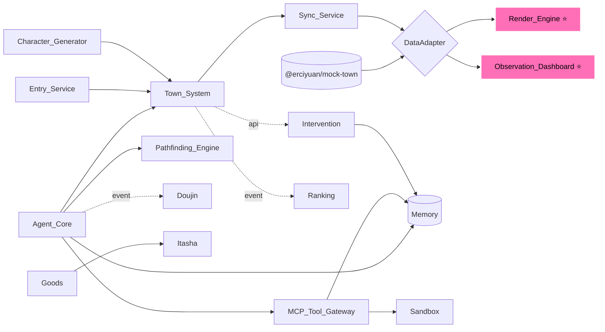

### Asset Manifest Data Model

`assets/MANIFEST.yaml` 在内存中以下列 TypeScript 结构表示。该结构是 `scripts/check-assets.ts` 启动校验脚本与 `tests/asset-manifest.test.ts` 资产清单测试的共同输入类型，定义在 `packages/types/asset-manifest.ts`。

```ts
type AssetCategory =
  | 'tilemap'        // 主地图 + tileset + 7 个分区地标
  | 'mascot'         // 7 类萌宠精灵与立绘
  | 'npc'            // 6 类 persona × 5 NPC
  | 'ui'             // 气泡 / 红条 / 图标 / Glass 纹理 / 转生粒子
  | 'audio'          // 转生音效 / 弹框 SFX / 翻页 SFX / BGM
  | 'font'           // 中文像素字体 / 罗马音字体
  | 'fallback'       // 网络断开 / 转生失败 / fallback 角色 / 全镇静态截图
  | 'mock'           // @erciyuan/mock-town 软数据源文件

type LicenseType = 'CC0' | 'CC-BY' | 'CC-BY-SA' | 'SELF'

type MascotType =
  | 'cat_lore' | 'dog_social' | 'hamster_hoard' | 'fox_create'
  | 'slime_newbie' | 'wolf_limited' | 'pigeon_buzz'

type ZoneId =
  | 'Convention_Plaza' | 'Cos_Studio' | 'Goods_Bazaar' | 'Doujin_Atelier'
  | 'Newbie_Lobby' | 'Limited_Info_House' | 'Buzz_Square'

type AssetEntry = {
  /** 相对 assets/ 的路径，例如 mascots/cat_lore/idle.png */
  path: string
  category: AssetCategory
  /** sha256:<hex>；用于版本审计与 strict 模式校验 */
  hash: string
  /** 实际文件大小（KB），与磁盘读到的字节数对齐到 KB */
  size_kb: number
  /** 第三方资产必填非 SELF；SELF 表示团队自制 */
  license: LicenseType
  /** 第三方资产的来源 URL；SELF 资产可填 SD prompt + 模型版本，亦可为空字符串 */
  source_url: string
  /** 作者或贡献者署名；团队自制写 "anime-agent-town team" */
  author: string
  /** 是否路演必跑（缺它就 fatal）；与 R29 required_for_demo 字段语义一致 */
  required_for_demo: boolean

  // —— 类别专属字段（按 category 决定是否填充） ——

  /** category === 'mascot' 必填 */
  mascot_type?: MascotType
  /** category === 'mascot' | 'npc' 必填，标识具体帧 */
  frame?: string
  /** category === 'npc' 必填 */
  persona_tag?: PersonaTag
  /** category === 'npc' 必填，01..05 序号 */
  npc_index?: number
  /** category === 'tilemap' 且为分区地标时必填 */
  landmark_for_zone?: ZoneId
}

type AssetManifest = {
  /** schema 版本，当前为 1 */
  version: number
  /** 生成时间，ISO 8601 字符串 */
  generated_at: string
  /** 资产总数 */
  total_count: number
  /** 资产总大小（KB） */
  total_size_kb: number
  /** 资产数组 */
  assets: AssetEntry[]
}
```

**与 SQLite 的关系**：Asset Manifest 不进入 SQLite 持久化。它是构建期资产，作为静态文件被 Next.js / Phaser 直接加载；运行时只读，不可变。`scripts/check-assets.ts` 在 `predev` / `prebuild` / `predemo` 钩子中执行，确保任何运行入口都先验证 manifest。

---

## Correctness Properties

*A property is a characteristic or behavior that should hold true across all valid executions of a system—essentially, a formal statement about what the system should do. Properties serve as the bridge between human-readable specifications and machine-verifiable correctness guarantees.*

本节基于上文 prework 分析，对全部 16 条 Requirements 的 ~70 项 acceptance criteria 进行了去重与合并，保留 10 条互不冗余、各自承担独特验证价值的核心属性。其中 **Property 1（Doujin round-trip）** 与 **Property 2（Thought_Trace JSONL round-trip）** 是用户明确点名的关键属性。

视觉相关的 Requirement 15（Smallville UI 还原度）与 Render_Engine 首屏渲染、Bento Grid 布局、Glassmorphism 视觉规范等条目**不属于属性测试范围**，统一交给 Playwright 视觉回归 + 单次性能测量 + 人工评审；详见 Testing Strategy。

### Property 1: 同人作品序列化 round-trip

*For any* 合法的 `Doujin` 作品对象 `d`（其 `kind` 取自 `'comic_4koma' | 'novel_short'`，且 payload 满足结构约束 —— 4 格漫画必须恰好 4 个 panel 且每格 caption 长度 ≤ 30；轻小说 text 长度 ≤ 400），先调用 `serializeDoujin(d)` 得到字符串 `s`，再调用 `deserializeDoujin(s)` 得到 `d'`，则 `d` 与 `d'` 在以下意义上语义等价：

- `d.doujin_id === d'.doujin_id`
- `d.characters` 与 `d'.characters` 顺序一致、元素相等
- `d.kind === d'.kind`
- `d.payload` 与 `d'.payload` 深度结构相等（panels 数组顺序、image_url、caption；novel text 完全一致）
- `d.watermark === d'.watermark`
- `d.created_at === d'.created_at`

**边界条件 / 反例形态注意事项**：
- 字段为空字符串（`watermark = ""`）应能通过 round-trip
- caption 包含 emoji、CJK 全角字符、HTML 转义字符（`&`, `<`, `"`）
- novel text 包含换行符 `\n` 与回车 `\r\n`
- `characters` 数组允许重复 character_id（联动同人）
- 时间戳负数 / 极大值

**Validates: Requirements 11.6, 11.7**

### Property 2: Thought_Trace 列表 JSONL round-trip

*For any* 合法的 `ThoughtTrace[]` 列表 `L`（每个元素 trace 满足：`trace_id`、`character_id`、`ts` 必填；`observation`、`plan` 为字符串；`next_action` 为合法 Action variant `move|tool|speak|idle`；`speech` 为字符串或 null；`error` 可选），先调用 `exportTraces(L)` 得到 JSONL 字符串 `j`（每行一个 trace、UTF-8、行尾 `\n`），再调用 `importTraces(j)` 得到 `L'`，则 `L` 与 `L'` 语义等价：

- `L.length === L'.length`
- 顺序保持：对所有 `i ∈ [0, L.length)`，`L[i]` 与 `L'[i]` 字段值深度相等
- `next_action.kind` 判别式保留；其 `target`/`name`/`args`/`text`/`duration_ms` 字段还原
- `speech === null` 与 `speech === ""` 必须区分（不能在 round-trip 中互相混淆）
- 缺省的 `error` 字段在 round-trip 后仍缺省（不变成 `error: null`）

**边界条件 / 反例形态注意事项**：
- 空列表 `[]` 应序列化为空字符串或仅一个 `\n`，反序列化回空列表
- 单元素列表（最末尾是否有 `\n` 不应影响结果）
- `args` 中包含嵌套对象、数组、布尔、null
- `observation`/`plan`/`speech` 中包含换行符、`{`、`"` 等 JSON 控制字符（必须正确转义而非把一行拆成多行）
- 极大列表（≥ 1000 条）不应丢条
- 含 Unicode 代理对（如 emoji `🐱`）

**Validates: Requirements 13.5, 13.6, 13.7**

### Property 3: 系统签发标识符的全局唯一性

*For any* 在同一域内由系统签发的标识符序列（`session_token`、`character_id`、`doujin_id`、`memory_id`、`trace_id`、`tool_call_id`），N 次签发返回的 N 个 ID 互不相同（无碰撞）。

**Validates: Requirements 1.1, 2.4, 11.3**

### Property 4: 角色所有权不变量

*For any* 通过会话 `s`（绑定 `user_id = U`）发起的角色生成调用所产生的角色 `c`，必有 `c.owner_user_id === U`；并且 *for any* 干预接口调用 `intervene(user_id=V, character_id=c.id)`，若 `V !== c.owner_user_id`，必返回 `status='forbidden'` 且产生一条审计日志。

**Validates: Requirements 2.7, 12.5**

### Property 5: A* 寻路时间与路径合法性

*For any* 64×64 网格、任意起点 `s`、终点 `g`、任意阻挡集合 `B`：
- 调用 `Pathfinding.plan(s, g, B)` 的执行时间严格 < 50 ms
- 若返回非空路径 `P = [p0, ..., pn]`，则 `p0 === s`、`pn === g`、相邻 Tile 曼哈顿距离恒为 1、所有 `pi ∉ B`
- 若 `g` 在 `B` 中或 `s` 与 `g` 不连通，则返回空路径

**Validates: Requirements 4.4, 4.5**

### Property 6: Memory 三因子检索的有界性与排序

*For any* 角色记忆库 `M`、查询 `q`、参数 `K`：
- `retrieve(M, q, K)` 返回长度 ≤ K
- 返回结果按 `score = w_r·recency + w_i·importance/10 + w_v·cos(emb_q, emb)` 单调非升排序
- 返回的每条记忆都来自 `M`（不凭空生成）
- `K = 0` 时返回空数组

**Validates: Requirements 5.1, 5.2, 5.3**

### Property 7: 速率限制器一致性

*For any* 受限调用序列（LLM 调用 1 次/10s/角色 [4.3]、反刷榜 3 次/5min/对话对 [9.4]、托梦 3 次/min/用户 [12.3]）与任意时间戳序列 `T`，对每个滑动窗口检查：
- 在窗口内被接受的调用数 ≤ 阈值
- 第 (阈值+1) 次调用被拒绝并返回对应错误（`rate_limit_exceeded` 或被忽略）
- 拒绝/忽略的调用不修改任何业务状态（不扣币、不加分、不写记忆）

**Validates: Requirements 4.3, 9.4, 12.3**

### Property 8: Sandbox 合规执行

*For any* MCP 工具调用 `(name, args)`：
- 若 `args` 不通过 `tools[name].input_schema` 校验，返回 `status='invalid_args'`，且世界状态（character、memory、relation、wallet 等任何持久化表行数与字段）前后 byte-for-byte 不变
- 若 handler 实际 CPU 时间 > 2s 或常驻内存 > 256 MB，沙盒在上限处终止，返回 `status='resource_exceeded'`
- 在所有以上分支（`ok`/`invalid_args`/`resource_exceeded`/异常），都恰好写入一条 `tool_call_log` 审计记录（包含 `character_id`、`tool_name`、`args`、`status`、`payload`、`duration_ms`）
- 沙盒子进程 PID ≠ 宿主进程 PID

**Validates: Requirements 6.4, 6.5, 14.1, 14.2, 14.3**

### Property 9: 经济守恒（虚拟谷子购买）

*For any* 钱包余额 `b`、SKU 价格 `p`、库存 `stock`、用户库存 `inv`，调用 `purchase(user, sku)`：
- 若 `stock === 0`，返回 `sold_out`，且 `wallet === b`（不扣币）、`inv` 不变、`stock` 不变
- 若 `stock > 0` 且 `b < p`，返回 `insufficient_funds`，状态全部不变
- 若 `stock > 0` 且 `b ≥ p`，返回 `ok`，且必有 `wallet' === b - p`、`stock' === stock - 1`、`|inv'| === |inv| + 1`（新加项 `sku === sku.sku_id`）
- 上述三种状态变更彼此互斥（不存在"扣币但未入库"或"入库但未扣库存"的中间态）

**Validates: Requirements 10.4, 10.6**

### Property 10: 降级模式状态机一致性

*For any* 触发降级的条件（LLM 不可用 ≥ 30s [16.3]、Memory 60s 内写失败 ≥ 5 次或检索 P95 > 2s [5.7]、单次 LLM 超时/解析失败 [4.7]、WebSocket 断连重连过程中 [7.5]）：
- 触发条件成立 ⇒ `Town.system_state` 变为 `degraded`
- 处于 `degraded` 时，Sync_Service 必发出 `system.degraded` 事件、前端必显示顶部 `DEGRADED MODE` 提示条
- 处于 `degraded` 时，Agent_Core 必使用脚本模式生成 trace（视觉上不停摆）
- WebSocket 重连过程中：仅在某次握手成功后才请求 snapshot 并标记 `recovered`，握手未稳期间不请求快照
- 触发条件解除 ⇒ 状态回到 `normal`，前端提示条消失，发出 `system.recovered` 事件
- 状态转换是幂等的：连续两次相同触发不产生两条 `degraded` 事件

**Validates: Requirements 4.7, 5.7, 7.5, 16.3, 16.5**

---

## Error Handling

错误处理设计遵循 **"先降级后告警"** 原则，确保 demo 现场不出现白屏或长时间卡顿。**Mock-First 数据管线是降级体系的最后一道防线**：任何后端故障都可一键 `feature.mock_mode = true` 切回 Mock 数据，画面继续动。

### 故障场景与降级路径

| 故障 | 触发条件 | 降级行为 | 用户可见反馈 |
|---|---|---|---|
| LLM API 不可用 | 单次超时 5s 或连续 30s 不可用 | Agent_Core 切回 Scripted 模式（FSM + 模板） | 顶部 `DEGRADED MODE: live LLM offline` 红条 |
| LLM 返回无法解析 | JSON parse 失败 / Schema 不符 | 当轮使用 Scripted 模式生成，trace.error 记录 | 单次 trace 标 ⚠ 标记 |
| 角色生成超时 | > 30s 未返回 | 从预制角色池随机抽取，`fallback=true` | 异世界转生动画自然结束、不报错 |
| WebSocket 断开 | 客户端 onclose | 指数退避重连：1,2,4,8,16s 上限 5 次；**仅握手成功后请求 snapshot**；期间 DataAdapter 自动播 Mock 事件保持画面动 | 屏幕角落连接状态指示灯：黄/红 |
| 5 次重连仍失败 | reconnect counter 耗尽 | 自动 `mock_mode = true` 切 Mock，提示用户刷新 | 顶部红条 + Mock 兜底提示 |
| Memory 单次写失败 | exception | trace.error += `memory_write_failed`，决策循环继续 | 仪表盘 trace 单条标 ⚠ |
| Memory 60s 内连续 ≥ 5 次失败 | 滚动窗口 | 暂停受影响角色决策循环；`system.memory_unstable` | 顶部红条 + 角色精灵半透明 |
| 工具调用资源超限 | CPU > 2s 或 RAM > 256MB | Sandbox 强杀子进程，返回 `resource_exceeded` | 单次 trace 标 ⚠ |
| 工具 args 非法 | input_schema 校验失败 | 返回 `invalid_args`，世界状态不变 | 单次 trace 标 ⚠ |
| 同人内容触发安全过滤 | 黑名单关键词命中 | 丢弃产物，记录 `reason='content_filtered'` | 仪表盘 doujin 流跳过该条 |
| 干预非自有角色 | ownership check 失败 | 返回 `forbidden` + 审计日志 | 前端 toast：`不能干预他人角色` |
| 速率超限（托梦/打榜） | 滑窗计数超阈值 | 返回 `rate_limit_exceeded`/忽略 | 前端 toast：`稍后再试` |
| **Phaser 加载失败** | Scene init throw | Render_Engine `setDegraded()` 切 DOM 模拟模式 | 顶部红条 `DEGRADED: render-fallback` |
| **Tilemap 解析失败** | tmj parse error | 加载 `town-static.png` 整张静态图 | 顶部红条 + 静态图可见 |
| **Mock 包加载失败** | dynamic import error | 浏览器内置 `fallback.png` 截图 | 顶部红条 + 提示重启 |

### 错误响应格式（HTTP）

```json
{
  "ok": false,
  "code": "INVALID_TOKEN" | "FORBIDDEN" | "RATE_LIMIT_EXCEEDED" | "RESOURCE_EXCEEDED" | "INVALID_ARGS" | "SOLD_OUT" | "CONTENT_FILTERED",
  "message": "human readable",
  "request_id": "uuid"
}
```

### 错误响应格式（WS）

```json
{ "type": "system", "kind": "degraded" | "recovered" | "memory_unstable", "payload": { "reason": "..." } }
```

### 现场降级 Runbook（demo 速查）

1. **LLM 故障** → 设置 `feature.live_llm = false`（控制台开关），整镇切脚本，视觉无变化
2. **WebSocket 全断** → 重启 Sync_Service 即可，前端会自动重连并 snapshot；超过 5 次自动切 Mock 模式
3. **后端整体崩溃** → 浏览器地址栏加 `?mock=1` 刷新，画面继续动（Tier 0–1）
4. **SQLite 损坏** → 清空 `./data/memory.db` 后重启，预制种子数据自动写入
5. **沙盒进程残留** → 控制台一键 `kill_zombie_sandboxes`
6. **页面白屏** → 浏览器 Ctrl+F5 强刷；session token 仍有效；若 Phaser 仍加载失败自动切 DOM 模拟
7. **Phaser 完全跑不起来** → URL 加 `?render=dom` 强制 DOM 模拟模式，至少 Tile 静态图 + 角色定位可见

---

## Testing Strategy

### 双轨测试方法

- **Unit/Example 测试**：覆盖具体例子、边界条件、UI 行为、视觉规范
- **Property 测试**：覆盖上节 10 条核心属性，每条 ≥ 100 次迭代
- **Integration 测试**：覆盖 WebSocket 联调、E2E 扫码到投放流程、性能 SLA
- **Visual Regression**：Playwright snapshot diff，覆盖 Smallville UI 还原度（Requirement 15）

### 测试栈

- 单元测试：**Vitest**（与 Next.js + TS 兼容）
- 属性测试：**fast-check**（TypeScript 生态最成熟的 PBT 库，不自研）
- 端到端：**Playwright**（含 WebSocket 监听、截图比对、视觉回归）
- 性能：**autocannon**（HTTP）+ 自研 WS 延迟测量脚本
- Mock 数据：直接 import `@erciyuan/mock-town`，前端测试与后端集成测试共享同一份夹具

### 属性测试配置规范

- 每个属性测试 **最少 100 次迭代**（`fc.assert(prop, { numRuns: 100 })`）；CI 全量跑 200 次
- 每个属性测试加注释 tag：
  ```
  // Feature: anime-agent-town, Property {n}: {property_text}
  ```
- 每条 Correctness Property 实现为 **单一**属性测试用例

### 测试用例分配（按属性）

| Property | 测试文件（建议） | 关键 generator |
|---|---|---|
| P1 Doujin round-trip | `doujin-serde.prop.test.ts` | `fc.oneof(comicArb, novelArb)` |
| P2 ThoughtTrace JSONL round-trip | `trace-jsonl.prop.test.ts` | `fc.array(traceArb, {maxLength: 1000})` |
| P3 ID 唯一性 | `id-uniqueness.prop.test.ts` | `fc.array(fc.constant(undefined), {minLength: 100})` |
| P4 角色所有权 | `ownership.prop.test.ts` | 随机 (user, char) 配对 |
| P5 A* 寻路 | `pathfinding.prop.test.ts` | 64×64 grid + 随机阻挡 |
| P6 Memory 三因子检索 | `memory-retrieve.prop.test.ts` | 随机记忆集 + 查询 |
| P7 速率限制器 | `rate-limit.prop.test.ts` | 时间戳序列生成器 |
| P8 Sandbox 合规 | `sandbox.prop.test.ts` | 随机 args + 黑盒 handler |
| P9 经济守恒 | `purchase.prop.test.ts` | 随机 (wallet, price, stock) |
| P10 降级状态机 | `degrade-state.prop.test.ts` | 随机故障注入序列 |

### Example/Unit 测试覆盖（UI-First 重心）

- **Render_Engine（Tier 0 重心）**：
  - Tile 加载、首屏 ≤ 2s（Playwright 性能 trace）
  - sprite manifest 解析与 4 方向 walk 帧切换
  - 气泡 4s 立即移除（DOM 断言：`getByText` → `wait 4s` → `expect.not.toBeInDocument`）
  - 动作描述 `is brewing coffee` 在 next_action.kind=tool 时显示
  - 相机跟随平滑系数 0.08 验证
  - 降级路径：模拟 Phaser load fail → 断言 DOM 模拟模式接管
- **Observation_Dashboard（Tier 0 重心）**：
  - Bento Grid 12×8 布局响应式断点（1440 / 1024 / 768）
  - Glassmorphism token 应用（CSS 计算值断言）
  - 24 主色色板扫描脚本（扫 sprite + theme tokens 不超过 24 色）
  - Thought Stream 滚动平滑性 + FIFO 50 条上限
  - 对话流 100 条上限 + 自动滚动暂停逻辑
  - JSONL 文件解析失败的友好报错（含错误行号）
  - DEGRADED MODE 红条 z-index、滑入动画
- **Mock-First 数据管线**：
  - `MockTownRuntime` 输出消息格式与 Sync_Service `ServerMsg` 逐字段一致（contract test）
  - `feature.mock_mode = true` / `false` 切换不影响 Render_Engine 渲染结果（snapshot diff）
- Entry_Service：QR 生成、token 过期、并发会话
- Character_Generator：预制池随机性、参考图色彩提取

### Visual Regression 测试（Requirement 15 专项）

不进行属性测试，使用 Playwright 的 `expect(page).toHaveScreenshot()`：

| 场景 | 断言 |
|---|---|
| 首屏小镇画面 | 与 `tests/snapshots/town-first-paint.png` 像素差 ≤ 2% |
| Smallville 风格气泡 | 单角色 + 单气泡 PNG 对比 |
| Bento Grid 仪表盘满屏 | 1440×900 截图对比 |
| 角色细节卡 | Smallville 排版 PNG 对比 |
| DEGRADED MODE 红条 | 启用降级后 200ms 截图对比 |
| 4 类功能区空间布局比例 | Tile 区域坐标范围断言（程序化检查 Tilemap JSON） |

### Integration 测试

- **E2E 扫码→投放→对话**：Playwright 模拟 3 个并发用户，10 分钟跑通主链路，断言：
  - 每个角色出现在地图上
  - 至少触发一次对话（speech 事件）
  - Dashboard 拉到 Thought_Trace
  - 导出 JSONL 文件后导入 round-trip 一致
- **WebSocket 重连**：故意 kill server 5s 后启动，断言客户端在退避序列内自愈、握手成功后才请求 snapshot
- **20 角色压测**：广播 P95 ≤ 1s（Requirement 16.2）
- **Mock fallback 链路**：手动 kill Sync_Service，断言前端在 5 次重连失败后自动 `mock_mode = true`，画面继续

### 不进行 PBT 的部分（明确不属于属性测试）

- **Smallville 视觉还原度（Requirement 15）**：使用 Playwright 视觉回归（snapshot diff）+ 人工评审
- **首屏渲染时间（15.6, 16.4）**：单次性能测量
- **24 FPS @ 20 角色（7.3）**：浏览器 INTEGRATION 测试，不重复属性化
- **场景空间布局比例（15.2）**：截图对比 Smallville 参考图，人工评审
- **二维码生成图像本身**：图像质量靠肉眼/扫码器实测
- **Bento Grid 响应式布局**：使用单元测试 + 视觉回归，不属性化

### 黑客松交付测试优先级

1. **Smoke**（demo 前必跑）：
   - 扫码进入、生成角色、投放、对话、Dashboard 滚动
   - **`?mock=1` 链路独立可跑**（保命底线）
2. **Property P1 + P2**（用户明确点名）：序列化 round-trip 必须 100% 通过
3. **Visual Regression**（Slice 0–2 关键画面）：Smallville UI 还原度 snapshot
4. **Property P5 + P10**：寻路性能 + 降级状态机（保证现场稳定）
5. **其余 Property + Example**：CI 后台跑，不阻塞现场

### MVP vs Stretch 测试边界

| 模块 | MVP 测试 | Stretch 测试 |
|---|---|---|
| Render_Engine | Tile 加载 + 气泡 + 视觉回归 + 降级路径 | 高级动画帧、相机自由模式 |
| Observation_Dashboard | Bento Grid + Glass token + P2 round-trip + UI smoke | Hot Trend / Faction War 卡片视觉回归 |
| Mock-First Pipeline | Contract test + DataAdapter 切换 snapshot diff | Stretch 模块 mock 数据扩充 |
| Agent_Core | Scripted 模式 P5/P6 | Live LLM P10 降级路径 |
| MCP_Tool_Gateway | 2 工具的 P8 | 5 个 Stretch 工具的 P8 |
| Memory_System | P6 三因子检索 + 写入 SLA | Reflection 触发属性 |
| Doujin_Generator | — | P1 round-trip（**Stretch 但是用户点名必做**） |
| Ranking/Goods/Itasha | — | P7（反刷榜）、P9（经济守恒） |
| Intervention | — | P4（所有权）、P7（速率） |

### Asset Inventory Tests（资产清单测试，对接 Pre-Slice 与 Asset Pipeline）

资产清单测试与 Pre-Slice 紧耦合：所有资产必须先通过这一组测试，业务代码 Slice 0 才允许动笔。该测试集合是 R29「资产准备契约」的可执行验证层，回答的核心问题是：**类别 A–L 的全部数量与质量契约是否兑现**。

#### 单元测试：tests/asset-manifest.test.ts

测试栈：Vitest + js-yaml 解析 `assets/MANIFEST.yaml`，对内存中的 `AssetManifest` 对象做断言。

| 断言 | 校验目标 | 关联 R29 条款 |
|---|---|---|
| 7 类 mascot_type 各自完整资产存在 | idle / portrait_64 / 4 方向 walk × 4 帧 / ≥ 2 动作帧 / persona_color / catchphrase 中文+罗马音 / core_traits ≥ 3 条 | R29.6–7 |
| 6 类 persona_tag NPC 各 ≥ 5 个，合计 ≥ 30 NPC | persona × npc_index 维度索引；每个 NPC ≥ 17 帧（idle×1 + 4 方向 walk×4） | R29.8–10 |
| 7 大功能区地标精灵齐全 | landmark_for_zone 7 个 ZoneId 各 ≥ 1 张 | R29.3 |
| 公用建筑 Tile 变体 ≥ 20 种 | tilemap 子类 prop/floor/wall 计数 | R29.4 |
| 视频 mock ≥ 12 条且覆盖 9 类 video_tags | 9 类二次元类目（Cos / 漫展 vlog / 动漫解说 / 角色分析 / 谷子开箱 / 手办 / 二次元穿搭 / 同城漫展 / 二创剪辑） | R29.11–12 |
| 漫展 mock ≥ 6 条且覆盖 ≥ 3 城市 | 每个漫展含 R22.2 全部 10 字段 + 关联 ≥ 3 个视频 ID（关联 ID 必须存在于视频 mock 集合） | R29.15–17 |
| 搭子 mock ≥ 20 条且 7 类 mascot_type 各 ≥ 2 | 每张 mock 一一关联类别 C 的 NPC sprite | R29.18–20 |
| 题库 ≥ 15 题、每题 7 选项 49 权重 | 权重值 ∈ [0, 1]；R18 给出的 3 道示例题被标记为「路演必跑」 | R29.13–14 |
| UI 图标 7 萌宠 + 11 搭子全齐 | icons_mascot 7 个文件名严格匹配 mascot_type；icons_companion 11 个文件名严格匹配 R24.2 11 类 | R29.27–28 |
| 内容发布模板齐全 | 视频脚本 ≥ 5 套（开头/中间/结尾）+ 发布文案 ≥ 5 套 + 话题标签 ≥ 10（含 #次元小镇 #二次元搭子 #漫展搭子 #Cos搭子）+ 合拍模板 ≥ 3 套 | R29.21–24 |
| 异常资源齐全 | network_disconnected.png / isekai_failed.png / fallback_character.png / town_static_snapshot.png 全部存在且 required_for_demo=true | R29.39–41 |
| 单文件大小 ≤ 1 MB；总包体积 ≤ 50 MB | 与启动校验脚本第 5 步一致 | R29 总量约束 |
| license 字段非空；非 SELF 资产必须有 source_url | 版权审计 | R29 manifest 字段契约 |

#### 属性测试（PBT）：tests/asset-manifest.prop.test.ts

属性测试覆盖 manifest 数据与磁盘文件之间的一致性不变量。最少 100 次迭代，每条属性测试加注释 tag。

```ts
// Feature: anime-agent-town, Property A1: manifest size_kb 与磁盘文件字节数一致（KB 取整）
// FOR ALL AssetEntry e ∈ manifest.assets:
//   e.path 对应的实际文件 buf 必须存在
//   且 |Math.round(buf.length / 1024) - e.size_kb| ≤ 4   (允许 ≤ 4 KB 抖动以容忍 KB 取整)

// Feature: anime-agent-town, Property A2: manifest hash 与文件内容 sha256 一致
// FOR ALL AssetEntry e ∈ manifest.assets:
//   e.hash === 'sha256:' + sha256(readFile(e.path)).hex
//   （strict 模式下硬断言；非 strict 模式下作为 PBT 警告）

// Feature: anime-agent-town, Property A3: 类别专属字段完整性
// FOR ALL AssetEntry e:
//   e.category === 'mascot' ⇒ e.mascot_type ∈ MascotType ∧ e.frame ≠ undefined
//   e.category === 'npc'    ⇒ e.persona_tag ∈ PersonaTag ∧ e.npc_index ∈ [1,5] ∧ e.frame ≠ undefined
//   e.category === 'tilemap' ∧ e.path 包含 "/landmarks/" ⇒ e.landmark_for_zone ∈ ZoneId

// Feature: anime-agent-town, Property A4: required_for_demo 资产无缺失
// FOR ALL AssetEntry e where e.required_for_demo === true:
//   fs.existsSync(resolve('assets', e.path)) === true
```

PBT generator 直接遍历 manifest（非随机化）；以"属性化遍历"代替随机生成，是因为输入空间是确定的清单本身，目标是覆盖 100% 条目，而不是探索 10% 的随机样本。**这是 PBT 用于资产验证的合理变体**：保留 PBT 框架（fast-check）但 generator 退化为列表遍历，仍能用 PBT 报告机制定位失败行号。

#### CI 集成

```yaml
# .github/workflows/ci.yml （示意）
jobs:
  lint:
    steps:
      - run: npm ci
      - run: npm run check:assets:strict       # 启动校验（含 hash strict）
      - run: npm test -- tests/asset-manifest   # 单元测试 + PBT
```

`check:assets` 在 lint 阶段必过，作为 PR 合并的硬性门槛。资产 PR 与代码 PR 走同一条 CI 流水线，杜绝"资产已经合进 main 但 manifest 未更新"的偏差。

#### 与 Smoke 测试的关系

R29 的 Pre-Slice 完成度门槛（`npm run check:assets` 全绿）等价于 Smoke 测试的最前置步骤。demo 当天的 smoke 检查表追加：

1. ✅ `npm run check:assets:strict` 退出码 0
2. ✅ `tests/asset-manifest.*` 测试集合 100% 通过
3. ✅ 7 大功能区在小镇地图上肉眼可见地标
4. ✅ 7 类萌宠图标在 Bento Grid 上可见
5. ✅ 4 张 fallback 资产在断网/Phaser kill 测试中能正确显示
