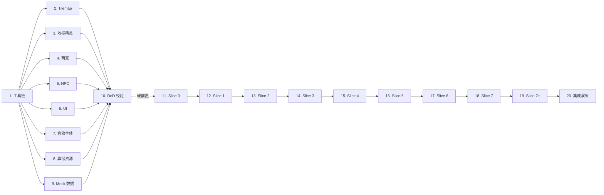

# Implementation Plan: 次元萌宠小镇 / anime-agent-town

## Overview

项目代号 **anime-agent-town**，对外名称「**次元萌宠小镇**」，参赛 **抖音黑客松赛道 1「AI 体验：刷到懂你的瞬间」**。

> **铁律：素材准备是硬前置。任务 1–10（Pre-Slice）必须全部完成且 `npm run check:assets` 全绿，才允许开始 Slice 0（任务 11 起）。素材不到，不开工。** 不允许跑去生成"垃圾占位素材"，必须按 design.md §5 与 requirements.md R29 的资产管线契约从合法免费素材源（Kenney CC0 / LPC CC-BY-SA / PIPOYA / OpenGameArt / Pixabay / itch.io CC0）下载、二次加工、登记 MANIFEST。

工期：黑客松 48 小时。Pre-Slice（任务 1–10）锁定开局前 ~1/4 时间窗，剩余时间用于 Slice 0–7 与集成演练。

**双链路 demo 主链路**（`requirements.md` Notes 段定义）：

- **A 链路（路演主推）**：`Page_VideoFeed` → `Page_Quiz` → `Page_MascotResult` → `Page_Recommend` → `Page_Town`，5 页跳转 ≤ 1s、总跑完 ≤ 95s（R28）
- **B 链路（小镇深度）**：扫码 QR → 角色生成 → 执念 → 进入 Smallville 风小镇 → 智能体自治 → 仪表盘审计（R1–R16）

两链路共享同一份 **Render_Engine**、**character 表**、**Mock-Town Package**。任一后端故障 → DEGRADED MODE 红条 + Mock 兜底，不允许白屏。

**实现语言**：TypeScript（全栈 Next.js 14 + Node.js 同栈，与 design.md `ts` 代码块一致）。

**技术栈**：Next.js 14 + App Router / React 18 / Phaser 3 / Tailwind + Framer Motion / `ws` WebSocket / better-sqlite3 + sqlite-vss / fast-check（PBT）。

**任务实施约定**：

- 顶层任务 20 个（任务 1–10 Pre-Slice，任务 11–20 Slice 0–7+ 与集成演练）
- 每个顶层任务末尾以 `_Requirements: …_` 引用 requirements.md 的细粒度子条款
- 子任务后缀 `*` 表示**可选测试任务**（PBT / 单元测试 / 集成测试），核心实现任务**绝不**带 `*`
- PBT 子任务标题前显式标注 `[PBT - P{n}]`，对应 design.md §Correctness Properties 的 P1–P10
- 子任务最多两层（`N` 与 `N.x`），符合 Kiro spec-task 标准

---

## Tasks

- [x] 1. 工具链准备 + 项目骨架 + 资产校验门
  - [x] 1.1 安装并验证 Tiled Map Editor（GPL，免费）
    - 下载 https://www.mapeditor.org/download
    - 验证：能打开 `.tmj` 并导出 64×64 网格
    - 在 README《工具链》段落写明本地安装路径
  - [x] 1.2 安装并验证像素图编辑器（LibreSprite 或 Aseprite，二选一）
    - 推荐 LibreSprite（GPLv2 免费）：https://github.com/LibreSprite/LibreSprite
    - 备选 Aseprite（付费 $19.99，团队预算允许时购买）：https://store.steampowered.com/app/431730/Aseprite/
    - 在线兜底 Piskel：https://www.piskelapp.com
    - 验证：能导出 sprite sheet 并保留透明通道
  - [x] 1.3 初始化 monorepo 目录骨架
    - `assets/{tilemaps,sprites,ui,audio,fonts,mock-thumbnails,fallback}/`
    - `packages/mock-town/`、`packages/types/`
    - `scripts/`、`tests/`
    - 顶层 `package.json` 配 npm workspaces
    - `tsconfig.base.json` 共享
  - [x] 1.4 编写 `scripts/check-assets.ts` 启动校验脚本
    - 严格按 design.md §5.1 节伪代码实现
    - 校验 MANIFEST.yaml 中所有 `required_for_demo=true` 资产文件存在性
    - 校验 license 字段非空（R29.52）
    - 校验单文件 ≤ 1 MB / tileset ≤ 512 KB / sprite sheet ≤ 256 KB / 总包 ≤ 50 MB（R29.53–56）
    - 缺失 → 退出码 1 + stderr 输出缺失清单 + 拒绝 silent fallback（R29.51）
  - [x] 1.5 配置 npm 钩子 `predev` / `prebuild` / `predemo`
    - 三个钩子均执行 `node scripts/check-assets.js`
    - 验证：缺资产时 `npm run dev` 必然中止（R29.50–52）
  - [x] 1.6 创建空 `assets/MANIFEST.yaml` 模板
    - `version: 1`
    - `assets: []`
    - 字段约定：path / category / hash / size_kb / license / source_url / author / required_for_demo（R29.49）
  - _Requirements: 29.49, 29.50, 29.51, 29.52, 29.53, 29.54, 29.55, 29.56, 29.60_

- [x] 2. 类别 A — Tilemap 与主 tileset 采购 + Smallville 风功能区布局
  - [x] 2.1 下载 Kenney RPG Urban Kit（CC0，含 480+ tile + 6 角色 4 方向）
    - 来源：https://kenney-assets.itch.io/rpg-urban-kit
    - 解压到 `assets/_raw/kenney-rpg-urban-kit/`
    - license 字段填 `CC0`，author 填 `Kenney`
  - [x] 2.2 下载 LPC RPG Pack base set（CC-BY-SA 3.0 / GPL 3.0，需署名）
    - 来源：https://lpc.opengameart.org/content/rpg-pack-base-set
    - 解压到 `assets/_raw/lpc-rpg-pack/`
    - 在 `README#Credits` 中登记原作者
  - [x] 2.3 下载兜底资源 Tiny RPG Town（免费商用）与 Exterior 32×32 Town tileset
    - https://ansimuz.itch.io/tiny-rpg-town
    - http://tempest.opengameart.org/content/exterior-32x32-town-tileset
  - [x] 2.4 在 Tiled 中合并/裁剪生成 `assets/tilemaps/tileset_main.png`
    - ≥ 64 种独立 Tile（R29.2）
    - 单文件 ≤ 512 KB（R29.54）
    - 24 主色板限定（R15.5）
    - 阻挡 Tile 标注 `properties.collide=true`（R29.5）
  - [x] 2.5 在 Tiled 中编辑 `assets/tilemaps/town_64x64.tmj` 主地图
    - 64×64 网格（R29.1）
    - 4 类原始功能区（广场 / 咖啡馆 / 住宅 / 公告栏）按 design.md §1.2 的 Tile 坐标范围铺设
    - 7 大主题分区（R25.1）坐标范围严格不重叠（R25.4）：Convention_Plaza / Cos_Studio / Goods_Bazaar / Doujin_Atelier / Newbie_Lobby / Limited_Info_House / Buzz_Square
    - 公用建筑/植物 Tile 变体 ≥ 20 种（R29.4）
  - [x] 2.6 MANIFEST.yaml 登记类别 A 全部资产
    - 每条登记 path / category=`tilemap` / hash / license / source_url / author / required_for_demo=true
    - 命名规范遵循 R29.48：`tile_{biome}_{layer}_{kind}_{variant}.png`
  - [x] 2.7* 类别 A 数量下限单元测试
    - `tests/asset-manifest-tilemap.test.ts`：tileset ≥ 1 张 / Tile 种类 ≥ 64 / 公用变体 ≥ 20 / 主地图 1 张
    - npm run check:assets 类别 A 断言通过
  - _Requirements: 29.1, 29.2, 29.3, 29.4, 29.5, 29.43, 29.44, 29.45, 29.46, 29.47, 29.48_

- [x] 3. 类别 A — 7 大功能区独特地标精灵
  - [x] 3.1 在 LibreSprite/Aseprite 中绘制 7 张地标精灵
    - `landmark_convention_arch.png`（漫展拱门 → Convention_Plaza）
    - `landmark_cos_studio_reflector.png`（Cos 反光板 → Cos_Studio）
    - `landmark_goods_shelf.png`（谷子货架 → Goods_Bazaar）
    - `landmark_doujin_easel.png`（创作阁画板 → Doujin_Atelier）
    - `landmark_newbie_signpost.png`（新人指引牌 → Newbie_Lobby）
    - `landmark_limited_sniper_tower.png`（限定狙击塔 → Limited_Info_House）
    - `landmark_buzz_tv_wall.png`（情报广场电视墙 → Buzz_Square）
    - 单张 ≤ 64 KB，配色遵循 24 主色板
  - [x] 3.2 在 Tiled tileset 中并入地标精灵作为 prop 层 Tile
    - 每张地标 Tile 标注 `landmark_for_zone=<zone_name>`
    - properties.collide=true（地标本体阻挡）
  - [x] 3.3 MANIFEST.yaml 登记 7 张地标 + `landmark_for_zone` 字段
    - category=`tilemap`，required_for_demo=true
  - _Requirements: 25.1, 25.2, 25.4, 29.3_

- [ ] 4. 类别 B — 7 类萌宠精灵采购与定制
  - [x] 4.1 下载 LPC Character Bases（CC-BY-SA 3.0 / GPL 3.0）作为基底
    - https://dnd.opengameart.org/content/lpc-character-bases
    - 解压到 `assets/_raw/lpc-character-bases/`
    - README#Credits 署名
  - [x] 4.2 下载 PIPOYA FREE RPG Character Sprites 32×32（商用免费）作为辅料
    - https://pipoya.itch.io/pipoya-free-rpg-character-sprites-32x32
    - 解压到 `assets/_raw/pipoya-32x32/`
    - 64 角色 4 方向 walk 现成可用
  - [x] 4.3 引用在线工具 Universal LPC Spritesheet Generator 加工
    - https://lpc.4wall.ai/ 或 https://github.com/LiberatedPixelCup/Universal-LPC-Spritesheet-Character-Generator
    - 用于快速合成 7 类萌宠的发色/瞳色/装饰
  - [x] 4.4 为 7 类 mascot_type 各产出完整资产集（≥ 26 帧/类，R29.6）
    - cat_lore（紫色 + 眼镜）：考据猫
    - dog_social（橙色 + 挥手）：扩列犬
    - hamster_hoard（米色 + 抱橡子）：囤囤鼠
    - fox_create（白尾尖 + 画笔）：太太狐
    - slime_newbie（淡蓝 + 果冻）：云仔
    - wolf_limited（深蓝 + 狙击）：限定狼
    - pigeon_buzz（粉白 + 麦克风）：咕咕鸽
    - 每类含：idle 立绘 1 张（≥ 32×32）+ 大头照 1 张（≥ 64×64）+ 4 方向 walk 各 4 帧 + 动作帧 ≥ 2
    - 命名遵循 `mascot_{mascot_type}_{frame}.png`（R29.7）
  - [x] 4.5 为 7 类萌宠填齐元数据
    - persona_color 主色十六进制
    - catchphrase 中文文案 + 罗马音文案各 1 条
    - core_traits 文案 ≥ 3 条
    - 数据存入 `packages/mock-town/src/mascots.ts`
  - [x] 4.6 MANIFEST.yaml 登记类别 B 全部资产
    - category=`mascot`，required_for_demo=true
    - 每张 sprite sheet ≤ 256 KB（R29.55）
  - [x] 4.7* 类别 B 完整性单元测试
    - 7 类 mascot_type × 必要帧位 全覆盖断言
    - `getMascotProfile()` 返回 9 字段全非空
  - _Requirements: 19.1, 19.2, 19.3, 19.4, 19.5, 29.6, 29.7, 29.48_

- [x] 5. 类别 C — 6 类 NPC 精灵采购
  - [x] 5.1 从 PIPOYA 与 LPC Character Bases 池中筛选 ≥ 30 个 NPC 角色
    - 来源：https://pipoya.itch.io/pipoya-free-rpg-character-sprites-32x32
    - 来源：https://dnd.opengameart.org/content/lpc-character-bases
    - 备选：https://pixelyarn.itch.io/cute-anime-sprites-school-edition（萌系风格）
  - [x] 5.2 按 6 类 persona_tag 分组（傲娇 / 病娇 / 天然呆 / 中二病 / 三无 / 腹黑）
    - 每类 ≥ 5 个 NPC，6 类合计 ≥ 30（R29.8）
  - [x] 5.3 为每个 NPC 切出 idle + 4 方向 walk = ≥ 17 帧（R29.9）
    - 命名遵循 R29.48：`npc_{persona_tag}_{slot}_{frame}.png`
  - [x] 5.4 编写 NPC 名字 + 口头禅文案
    - 每 NPC 各 ≥ 1 条（R29.10）
    - 数据存入 `packages/mock-town/src/npcs.ts`
  - [x] 5.5 MANIFEST.yaml 登记类别 C 全部资产
    - 字段：persona_tag / npc_index / frame
    - category=`npc`
  - _Requirements: 29.8, 29.9, 29.10_

- [x] 6. 类别 I — UI 视觉资源采购与定制
  - [x] 6.1 下载 Pixel UI pack（750 assets）作为主素材
    - https://opengameart.org/content/pixel-ui-pack-750-assets
  - [x] 6.2 下载 Kenney UI Pack（CC0）作为兜底
    - https://kenney-assets.itch.io/ui-pack
  - [x] 6.3 制作 Smallville 风白底气泡 SVG（含尾巴朝下变体）
    - 严格遵循 design.md §1.4：`#FFFFFF` 底 / `#1A1A1A` 2px 边 / 圆角 8px / 阴影 `0 2px 0 rgba(0,0,0,0.25)`
    - 文件：`assets/ui/bubble_white.svg` + `bubble_white_tail_down.svg`（R29.25）
  - [x] 6.4 制作 DEGRADED MODE 红条 SVG/CSS 样式
    - `assets/ui/degraded_bar.svg` + `assets/ui/degraded_bar.css`
    - 渐变 `linear-gradient(90deg, #FF6F6F 0%, #FF8B6F 100%)`（R29.26）
  - [x] 6.5 制作 7 类萌宠图标 SVG
    - 与 mascot_type 一一对应（R29.27）
    - 文件命名：`ui_mascot_{mascot_type}.svg`（R29.48）
  - [x] 6.6 制作 11 类搭子类型图标 SVG
    - 漫展 / Cos / 拍照 / 逛摊 / 买谷 / 同作品 / 同城 / 视频合拍 / 新手求带 / 抢限定 / 二创（R24.2、R29.28）
    - 文件命名：`ui_companion_{type}.svg`
  - [x] 6.7 制作 Glassmorphism 卡片背景纹理 PNG
    - `assets/ui/glass_card_bg.png`（R29.29）
  - [x] 6.8 制作异世界转生粒子贴图与背景图 ≥ 3 张
    - `assets/ui/isekai_particles.png`、`assets/ui/isekai_bg_{1..3}.png`（R29.30）
  - [x] 6.9 MANIFEST.yaml 登记类别 I 全部资产
    - category=`ui`，命名遵循 `ui_{kind}_{variant}.svg|png`
  - _Requirements: 29.25, 29.26, 29.27, 29.28, 29.29, 29.30_

- [x] 7. 类别 J — 音效与字体采购
  - [x] 7.1 下载异世界转生主音效（Pixabay License，免费商用免署名）
    - 主选：https://pixabay.com/sound-effects/magic-sparkle-190030/
    - 截到 3–8s（与 R2.5 / R29.31 时长一致）
    - 输出 `assets/audio/isekai_jingle.mp3`
  - [x] 7.2 下载弹框掉落 SFX
    - https://pixabay.com/sound-effects/cartoon-wink-magic-sparkle-6896/
    - 输出 `assets/audio/popup_drop.mp3`（R29.32）
  - [x] 7.3 下载点击 / 翻页 SFX ≥ 3 段
    - 列表搜索 https://pixabay.com/sound-effects/search/sparkle/
    - 兜底 Kenney UI Audio：https://kenney-assets.itch.io/ui-audio
    - 输出 `assets/audio/click_{01..03}.mp3`（R29.33）
  - [x] 7.4 下载萌宠生成成功 BGM
    - Pixabay 搜索 cute / cheerful / pixel
    - 输出 `assets/audio/mascot_born_bgm.mp3`（R29.34）
  - [x] 7.5 下载中文像素字体 Vonwaon Bitmap Font（CC0 1.0，首选）
    - https://timothyqiu.itch.io/vonwaon-bitmap
    - 备选 Zpix 最像素（OFL，CN+JP）：https://github.com/SolidZORO/zpix-pixel-font
    - 输出 `assets/fonts/pixel_zh.ttf`（R29.35，覆盖 GB2312）
  - [x] 7.6 下载英文/罗马音像素字体 Ark Pixel Font 12px（OFL 1.1）
    - https://github.com/TakWolf/ark-pixel-font
    - 输出 `assets/fonts/pixel_en_romaji.ttf`（R29.36）
  - [x] 7.7 MANIFEST.yaml 登记类别 J 全部资产
    - license 字段全部非空（R29.44，强制断言）
    - category=`audio` / `font`
  - _Requirements: 29.31, 29.32, 29.33, 29.34, 29.35, 29.36, 29.43, 29.44, 29.45_

- [x] 8. 类别 L — 异常场景插画与 fallback 资产
  - [x] 8.1 制作网络断开提示插画
    - 基于 Kenney UI / Pixel UI pack 二次绘制
    - `assets/fallback/network_disconnected.png`（R29.39）
  - [x] 8.2 制作转生失败提示插画
    - `assets/fallback/isekai_failed.png`（R29.40）
  - [x] 8.3 选定 fallback 像素角色
    - 从 PIPOYA 池挑一个憨憨角色作为 R2.6 fallback 池主力
    - `assets/fallback/fallback_character.png`（R29.41）
  - [x] 8.4 占位全镇静态截图（Slice 0 完成后用 Phaser 截图替换）
    - 先用 Tiled 导出占位 PNG 作为暂存
    - `assets/fallback/town_static_snapshot.png`（R29.42）
  - [x] 8.5 MANIFEST.yaml 登记类别 L
    - category=`fallback`，required_for_demo=true
  - _Requirements: 29.39, 29.40, 29.41, 29.42_

- [x] 9. Mock 数据 npm 包初始化（@erciyuan/mock-town）
  - [x] 9.1 初始化 `packages/mock-town/`
    - `package.json`：name=`@erciyuan/mock-town`，version=`0.1.0`
    - 仅依赖 TS 类型库，**不依赖 Phaser / React / Node fs**（design.md §3 关键约束）
    - 接入根 workspace
  - [x] 9.2 写 `src/videos.ts` ≥ 12 条视频 mock（A 链路 Page_VideoFeed）
    - 覆盖 9 类 video_tags（Cos / 漫展 vlog / 动漫解说 / 角色分析 / 谷子开箱 / 手办 / 二次元穿搭 / 同城漫展 / 二创剪辑）（R29.12）
    - thumbnail 字段引用 Unsplash URL（cosplay / anime-cosplay / comic-con / anime-culture）：
      - https://unsplash.com/s/photos/cosplay
      - https://unsplash.com/s/photos/anime-cosplay
      - https://unsplash.com/s/photos/comic-con
      - https://unsplash.com/s/photos/anime-culture
    - 缩略图离线裁剪到 540×960（R29.11）
    - 字段：thumbnail / author_name / avatar / title / video_tags / contextual_intent / duration / play_count
  - [x] 9.3 写 `src/conventions.ts` ≥ 6 个漫展 mock
    - 覆盖 ≥ 3 城市（R29.16）
    - 每个漫展含 R22.2 全部 10 字段（R29.15）
    - 关联 ≥ 3 视频 ID（R29.17）
  - [x] 9.4 写 `src/companions.ts` ≥ 20 搭子 NPC mock
    - 7 类 mascot_type 各 ≥ 2（R29.19）
    - 一一关联类别 C NPC sprite（R29.20）
    - 含 R24.3 全部字段
  - [x] 9.5 写 `src/quizzes.ts` ≥ 15 题
    - 每题 7 选项 × 7 mascot_type = 49 权重，权重 ∈ [0, 1]（R29.13）
    - R18 给出的 3 道示例题打 `must_run=true` 标记（R29.14）
  - [x] 9.6 写 `src/publish_templates.ts`
    - 视频脚本 ≥ 5 套（开/中/结三段式，R29.21）
    - 发布文案 ≥ 5 套（R29.22）
    - 话题标签 ≥ 10 个，必含 `#次元小镇 #二次元搭子 #漫展搭子 #Cos搭子`（R29.23）
    - 合拍模板 ≥ 3 套（R29.24）
  - [x] 9.7 写 `src/doujins.ts` ≥ 5 篇同人 mock
    - 4 篇 4 格漫画（拼接像素图 + 每格对白 ≤ 30 字符）+ 1 篇短小说（≤ 400 字符）（R29.37）
    - 全部通过 R11 round-trip（R29.38）
  - [x] 9.8 写 `src/timeline.ts` 90 秒预录"小镇活着"事件流
    - pos / speech / thought 混合
    - 与 Sync_Service `ServerMsg` schema 逐字段一致（design.md §Mock-First）
  - [x] 9.9 实现 `src/runtime.ts` MockTownRuntime
    - 接口：`startRuntime({ onEvent, loop }) => MockRuntimeHandle`
    - 提供 `stop()` / `jumpTo(seconds)`
    - 失败降级：`setTimeout` 静态播 traces
  - [x] 9.10 导出 TypeScript 类型到 `src/index.ts`
    - 编译期校验字段完整性（R29.59）
    - schema 变更时升 minor version（R29.58）
  - [x] 9.11 MANIFEST.yaml 登记 mock-town 各源文件
    - category=`mock-data`
  - _Requirements: 29.11, 29.12, 29.13, 29.14, 29.15, 29.16, 29.17, 29.18, 29.19, 29.20, 29.21, 29.22, 29.23, 29.24, 29.37, 29.38, 29.57, 29.58, 29.59_

- [ ] 10. 资产清单全量校验门槛（DoD，硬前置）
  - [x] 10.1 跑 `npm run check:assets:strict`
    - hash 严格匹配
    - 所有 required_for_demo=true 资产存在
    - 单文件 ≤ 1 MB / tileset ≤ 512 KB / sprite sheet ≤ 256 KB / 总包 ≤ 50 MB（R29.53–56）
  - [x] 10.2* `tests/asset-manifest.test.ts` 类别 A–L 数量下限单元测试
    - A：tileset ≥ 1 / Tile ≥ 64 / 公用 ≥ 20 / 7 地标
    - B：7 类 × 必要帧
    - C：≥ 30 NPC，6 类 × ≥ 5
    - D：≥ 12 视频
    - E：≥ 15 题
    - F：≥ 6 漫展，≥ 3 城市
    - G：≥ 20 搭子
    - H：≥ 5 脚本 + ≥ 5 文案 + ≥ 10 标签 + ≥ 3 合拍
    - I：UI 全套
    - J：音效字体全套
    - K：5 篇同人
    - L：4 张异常资产
  - [x] 10.3* `tests/asset-manifest.prop.test.ts` PBT（fast-check ≥ 100 次迭代）
    - **Property A1**：manifest size_kb 与磁盘文件字节数一致（KB 取整）
    - **Property A2**：manifest hash 与磁盘文件 SHA-256 一致
    - **Property A3**：每条 entry 的 category 字段属于合法枚举集合
    - **Property A4**：required_for_demo=true 时 license / source_url / author 三字段非空
  - [x] 10.4 检查体积上限
    - 总包 ≤ 50 MB，超出则压缩或剔除非 required_for_demo
  - [x] 10.5 README#Credits 段补齐 CC-BY / CC-BY-SA 资产署名
    - LPC RPG Pack / LPC Character Bases / Pixel UI pack（R29.45）
    - 拒绝未授权 IP 角色立绘（R29.46）
  - [x] 10.6 任务 10 完成 → DoD 达成 → 解锁 Slice 0
    - **门槛达成才允许进入任务 11 起的业务代码**
    - 在团队 channel 公告"素材就绪，开工"
  - _Requirements: 29.43, 29.44, 29.45, 29.46, 29.47, 29.48, 29.49, 29.50, 29.51, 29.52, 29.53, 29.54, 29.55, 29.56_

- [ ] 11. Slice 0 — 可见小镇骨架（Tier 0）
  - [x] 11.1 初始化 Next.js 14 + App Router + TypeScript
    - `app/` 目录骨架
    - 严格 TypeScript（strict: true）
    - 配 ESLint + Prettier
  - [x] 11.2 集成 Phaser 3 + PhaserBridge React 组件
    - `src/render/PhaserBridge.tsx`：把 Phaser Scene 挂载到 React DOM
    - Phaser 配 `type: AUTO`，WebGL 失败时自动回落 CANVAS
  - [x] 11.3 配 Tailwind + Glassmorphism design tokens
    - `src/theme/tokens.ts` 严格按 design.md §2.2 落地（24 主色板 R15.5）
    - tailwind.config.js extend 主题色
  - [x] 11.4 RenderEngine 加载 town_64x64.tmj + tileset_main.png
    - 接口实现 design.md §1.9 `RenderEngine.init()`
    - Loading Scene 显示像素风加载条
    - 首屏 critical path：tileset_main.png + tilemap.tmj + sprite_default.png
    - `<link rel="preload">` 提前推 critical 资源
    - 首屏 ≤ 2s（R7.1, R15.6, R16.4）
  - [x] 11.5 spawnSprite 渲染 3 个静态精灵（占位）
    - 调用 design.md §1.9 `spawnSprite()`
    - 角色站位与 Mock characters 一致
  - [x] 11.6 实现相机控制
    - 跟随模式：`startFollow(target, true, 0.08, 0.08)`（R7.3 软跟随）
    - 自由摄像：按住空格 + 拖拽，松开后慢速回到跟随
    - 3 档缩放（×1 / ×1.5 / ×2），平滑过渡 200ms
    - 边界约束：相机不越出 Tilemap
  - [x] 11.7 DO                 M 模拟模式 fallback
    - Phaser 完全跑不起来时：`` 渲染 town_static_snapshot.png + `<div>` 模拟精灵位置
    - 严格遵循 design.md §1.8 降级表：绝不白屏
  - [x] 11.8 替换 fallback/town_static_snapshot.png
    - Slice 0 跑通后从 Phaser 截图导出
    - 覆盖任务 8.4 的占位
  - _Requirements: 7.1, 7.3, 15.1, 15.2, 15.5, 15.6, 25.4_

- [x] 12. Slice 1 — 会动的小镇（Mock 驱动，Tier 0–1）
  - [x] 12.1 接入 `@erciyuan/mock-town` startRuntime 90s 时间轴回放器
    - 在 RenderEngine 上消费 `MockTownAPI` 的 ServerMsg 事件流
    - 与未来 Sync_Service 输出 schema 完全一致（design.md §Mock-First）
  - [x] 12.2 实现 DataAdapter 接口（mock | live 二选一）
    - 严格按 design.md §DataAdapter 落地
    - 触发开关：`?mock=1` URL 参数 / 环境变量 / Dashboard 设置面板
    - 默认 `feature.mock_mode=true`
  - [x] 12.3 角色按 timeline 假装走路
    - `moveSprite(charId, to, durationMs)` 消费 move 事件序列
    - 4 方向 walk 帧动画 8 FPS
  - [x] 12.4 Smallville 风白底气泡渲染
    - React 组件 + Framer Motion 弹出
    - 4 秒后**立即移除（不淡出）**（R7.6 明确）
    - 单条 ≤ 80 字符，超长截断（R8.2）
  - [x] 12.5 角色脚下动作描述
    - 当 `next_action.kind != 'idle'` 时显示（design.md §1.5）
    - 文本如 `is brewing coffee` / `is talking with Hina`
    - 持续与 next_action 一致，结束立即清除
  - [x] 12.6 Mock fallback 兜底链路
    - `MockTownRuntime` 失败 → 切到 traces 静态列表 setTimeout 静态播
    - 保证画面继续动
  - _Requirements: 7.2, 7.5, 7.6, 8.5, 15.3_

- [ ] 13. Slice 2 — Bento Grid 仪表盘骨架（Tier 1）
  - [x] 13.1 实现 12×8 Bento Grid 布局组件 + 响应式断点
    - 严格按 design.md §2.1 网格分配
    - 断点：≥ 1440 / 1024–1440 / < 1024
    - gap 16px
  - [x] 13.2 Glassmorphism 卡片样式应用 design tokens
    - `surface` / `border` / `blur` / `shadow` / `radius` 全部 token 化
  - [x] 13.3 Thought Stream 滚动卡（最近 50 条 FIFO）
    - 单条卡 84px，字段 timestamp / observation / plan / next_action / speech
    - 标签颜色：move=cyan / tool=pink / speak=lime / idle=mute
    - Framer Motion `layout` 平滑下移（R13.2）
    - 失败 ⚠ 显示橙色 4px 竖线
  - [x] 13.4 全镇对话流侧边栏（最近 100 条时间倒序）
    - 头像 32px + → + 对方头像 + 文本一行
    - 文本 ≤ 60 字符截断 + hover 浮窗
    - 用户滚动时暂停自动滚动，3s 无操作恢复（R13.3）
  - [x] 13.5 Smallville 风角色细节卡（Smallville 排版复刻）
    - 头像 64×64 + 姓名 + Persona Tag
    - Activity / Plan / Recent Memory Top 5（R13.1, R15.4）
    - 严格按 design.md §2.6 排版
  - [x] 13.6 DEGRADED MODE 红条组件
    - 顶部固定 z-index 9999 + 滑入 200ms（design.md §2.8）
    - 不可手动关闭
    - hover 弹出全部 reason 列表
  - [x] 13.7 JSONL 导出按钮
    - 调用 `GET /api/dashboard/export?character_id=...`
    - 下载文件名 `traces-{character_id}-{ts}.jsonl`（R13.5）
  - [x] 13.8 JSONL 导入拖拽区
    - 接受 `.jsonl` `.json`，文件 ≤ 10 MB
    - 解析失败：错误行号 + 跳过该行选项
    - 成功：toast `导入 N 条 trace`（R13.6）
  - [ ] 13.9* [PBT - P2] Thought_Trace JSONL round-trip 属性测试
    - **Property 2: Thought_Trace 列表 JSONL round-trip**
    - **Validates: Requirements 13.5, 13.6, 13.7**
    - fast-check ≥ 100 次迭代
    - 覆盖 emoji / CJK / HTML 转义 / 换行符 / 极值时间戳
  - _Requirements: 13.1, 13.2, 13.3, 13.4, 13.5, 13.6, 13.7, 15.4, 16.5_

- [ ] 14. Slice 3 — 抖音流弹框 + 测一测 + 萌宠生成（A 链路核心）
  - [-] 14.1 实现 Page_VideoFeed（抖音风视频流模拟）
    - 消费 `mock-town.videos`
    - 竖屏 540×960 视频卡 + 上下滑动切换（R28.1）
  - [-] 14.2 实现 Douyin_Stream_Hook
    - 5s 观看阈值（R17.1）
    - 同会话 10min 频控（R17.3）
    - 弹框文案池 ≥ 3 套随机（R17.2）
    - hook_event 事件写入 Memory_System（R17.6）
    - contextual_intent 字段携带（R17.5）
    - 已有萌宠回访形态切换（R17.4）
  - [-] 14.3 实现 Page_Quiz
    - 3–5 题轻量测试 UI，单题平均 ≤ 8s（R18.1）
    - 7 选项 × 7 mascot_type 向量加权（R18.3）
    - 动态题 ≥ 1 道，基于 contextual_intent（R18.2）
    - 草稿持久化 24 小时（R18.6）
  - [-] 14.4 实现 Mascot_System
    - 7 类枚举（R19.1）
    - `getMascotProfile(mascot_type)` 接口（R19.3）
    - 主标签向量近邻冲突 → fallback `slime_newbie`（R19.5）
    - character 表注入 mascot_type 字段（R19.4，与 persona_tag 并存）
  - [ ] 14.5 实现 Page_MascotResult
    - 萌宠形象 ≥ 32×32 + 立绘 + display_name（R20.1）
    - ≥ 3 个兴趣关键词 + 推荐内容方向 + 推荐区域 + 推荐搭子类型 + CTA
    - 转生动画结束后 2s 内首屏渲染（R20.2）
    - 停留 3s 自动激活 Page_Recommend（R20.3）
    - "分享到抖音"按钮生成带水印 PNG/视频卡片（R20.4）
  - [ ] 14.6 实现异世界转生动画
    - 持续 3–8s（R2.5）
    - 5 帧分镜 + 异世界粒子贴图 + isekai_jingle.mp3
  - [ ] 14.7* Quiz_Service 单元测试
    - 7 选项权重和 = 49 断言
    - 草稿恢复 24h 内有效断言
  - _Requirements: 17.1, 17.2, 17.3, 17.4, 17.5, 17.6, 18.1, 18.2, 18.3, 18.4, 18.5, 18.6, 19.1, 19.2, 19.3, 19.4, 19.5, 20.1, 20.2, 20.3, 20.4_

- [ ] 15. Slice 4 — 推荐 Feed + 漫展卡片 + 搭子匹配
  - [ ] 15.1 实现 Page_Recommend 推荐 Feed
    - 6 类内容各 1 条（R21.1）：同风格 Cos / 同作品角色解说 / 二次元穿搭教程 / 谷子开箱 / 漫展 vlog / 萌新入坑指南
    - reason_text ≤ 30 字符（R21.3）
    - 点击事件 → affinity 信号写入 Memory_System（R21.4）
  - [ ] 15.2 实现 Recommendation_Engine
    - 三因子：mascot_type + contextual_intent + 位置（R21.2）
  - [ ] 15.3 实现 Convention_Service 同城漫展推荐
    - ≥ 3 个推荐 / 30 天内 / 同城或邻近（R22.1）
    - 卡片 10 字段全填（R22.2）
    - 推荐理由含具体描述，禁通用模板（R22.3）
    - 拒绝授权或无活动 → fallback 全国热门榜（R22.4）
  - [ ] 15.4 实现漫展详情页
    - 8 个内容分区（R23.1）
    - "进入小镇该漫展专属广场"CTA（R23.2）
    - 视频列表"为我推荐"标签优先排序（R23.3）
    - 无视频 → "邀请你成为第一个发布者"CTA → 跳 R27（R23.4）
  - [ ] 15.5 实现 Companion_Match 6 因子确定性匹配
    - 因子：mascot_type / 兴趣关键词 / 点击行为 / 漫展意向 / 地理位置 / 社交偏好（R24.1）
    - **相同输入相同输出**（R24.4，确定性，便于 PBT）
  - [ ] 15.6 实现搭子卡片
    - 11 类搭子类型覆盖（R24.2）
    - 字段：对方萌宠形象 / mascot_type / 共同兴趣点 ≥ 1 / 匹配度 % / 漫展意向 / 想找搭子类型 / 破冰方式（R24.3）
    - 拒绝搭子 → 7 天屏蔽（R24.6）
    - 候选池 < 5 真实用户 → NPC 填充 + `is_npc=true`（R24.5）
  - [ ] 15.7* 推荐 reason_text 长度 PBT
    - fast-check ≥ 100 次迭代：reason_text.length ≤ 30 字符
  - _Requirements: 21.1, 21.2, 21.3, 21.4, 22.1, 22.2, 22.3, 22.4, 23.1, 23.2, 23.3, 23.4, 24.1, 24.2, 24.3, 24.4, 24.5, 24.6, 24.7_

- [ ] 16. Slice 5 — Sync_Service WebSocket + 后端注水
  - [ ] 16.1 实现 Sync_Service WebSocket Hub
    - Node `ws` 库
    - 频道订阅：`town` / `dashboard` / `char:{id}`
    - 严格按 design.md §3 协议（R7.2）
  - [ ] 16.2 实现 ServerMsg / ClientMsg 协议
    - 消息类型：pos / speech / action_label / thought / system / heartbeat
    - 与 mock-town ServerMsg schema 逐字段一致
  - [ ] 16.3 实现心跳机制
    - 服务端每 30s 推 heartbeat（R7.4）
    - 客户端无 pong 超时认定断连
  - [ ] 16.4 客户端指数退避重连
    - 1, 2, 4, 8, 16s，上限 5 次（R7.5）
    - **仅在握手成功后才请求 snapshot 并标记 recovered**
  - [ ] 16.5 DataAdapter 切到 live 模式
    - `feature.mock_mode=false` 时使用 LiveDataAdapter
    - 同一份 ServerMsg → Render_Engine + Dashboard 复用
  - [ ] 16.6 5 次重连失败自动 mock_mode = true
    - 与 design.md §Cookbook 现场降级 Runbook 对齐
    - 顶部红条提示 `DEGRADED MODE: ws fallback`
  - [ ] 16.7* Sync_Service 广播延迟单元测试
    - 模拟 20 角色，断言广播 P95 ≤ 1s（R16.2）
  - _Requirements: 7.2, 7.4, 7.5, 16.2_

- [ ] 17. Slice 6 — Agent_Core 脚本行为 + Memory + MCP（Tier 2–3）
  - [ ] 17.1 实现 Agent_Core scripted 模式（FSM + 模板填充）
    - 单次生成 ≤ 200ms（R4.2）
    - Thought_Trace Schema：observation / plan / next_action / speech / error（R4.1）
    - 输出与真实 LLM 输出**结构上不可区分**
  - [ ] 17.2 实现冲突仲裁
    - 同 Tile 多角色按 `(character_id, ts)` 字典序选发起者（R4.6）
  - [ ] 17.3 实现 Pathfinding_Engine A* 寻路
    - 不调用 LLM
    - 单次 < 50ms 硬上限（R4.5）
    - 读取 Tilemap `properties.collide`（R29.5）
  - [ ] 17.4* [PBT - P5] Pathfinding A* 时间与路径合法性
    - **Property 5: A* 寻路时间与路径合法性**
    - **Validates: Requirements 4.4, 4.5**
    - fast-check ≥ 100 次迭代
    - 任意 64×64 网格 + 起终点 + 阻挡集，断言：耗时 < 50ms / 路径每步合法 / 终点匹配
  - [ ] 17.5 实现 Memory_System
    - SQLite + sqlite-vss 向量索引
    - 4 类记忆 type：observation / dialogue / action / reflection（R5.1）
    - write 接口端到端 ≤ 200ms（R5.5）
    - 三因子检索 retrieve(top-K=8)：recency + importance + relevance（R5.3）
  - [ ] 17.6* [PBT - P6] Memory 三因子检索的有界性与排序
    - **Property 6: Memory 三因子检索的有界性与排序**
    - **Validates: Requirements 5.1, 5.2, 5.3**
    - fast-check ≥ 100 次迭代
    - 断言：返回 ≤ K 条 / 按综合分排序 / 任一因子单调改变 → 排序按预期改变
  - [ ] 17.7 健康监测 60s 滑窗
    - 写入失败 ≥ 5 次或检索 P95 > 2s → 暂停受影响角色决策 + 红条（R5.7）
  - [ ] 17.8 实现 MCP_Tool_Gateway
    - `coffee_machine.brew`：name / description / input_schema（R6.1）
    - `bulletin_board.post`：name / description / input_schema
    - 1s 内返回 status + payload（R6.2）
    - input_schema 校验失败 → status='invalid_args'，不修改世界状态（R6.4）
    - 每次调用入参/出参/character_id 写入 Memory_System 审计日志（R6.5）
  - [ ] 17.9 实现 Sandbox `child_process.fork` 隔离
    - CPU ≤ 2s（R14.2）
    - RAM ≤ 256 MB（R14.2）
    - 超限 → status='resource_exceeded'（R14.3）
    - 宿主进程不直接访问工具内部状态（R14.1）
  - [ ] 17.10* [PBT - P8] Sandbox 合规执行
    - **Property 8: Sandbox 合规执行**
    - **Validates: Requirements 6.4, 6.5, 14.1, 14.2, 14.3**
    - fast-check ≥ 100 次迭代
    - 断言：CPU/RAM 上限严守 / 状态守恒（input_schema 失败时世界状态不变）/ 审计日志原子写入
  - _Requirements: 4.1, 4.2, 4.4, 4.5, 4.6, 5.1, 5.2, 5.3, 5.5, 5.6, 5.7, 6.1, 6.2, 6.4, 6.5, 14.1, 14.2, 14.3, 14.4_

- [ ] 18. Slice 7 — 小镇 7 大分区 + 轻互动 + 内容发布闭环
  - [ ] 18.1 小镇 7 大主题分区扩展
    - 按 mascot_type 主场对应（R25.1）
    - 7 大分区 Tile 坐标在 design.md §1.2 / §3 中明确划定，且严格不重叠（R25.4）
    - 用户在 MascotResult 选"进入次元小镇" → 投放到对应主场分区入口（R25.3）
  - [ ] 18.2 7 大分区独特地标精灵接入 Render_Engine
    - 加载任务 3 制作的 7 张地标精灵
    - prop 层渲染（R25.2）
  - [ ] 18.3 实现 Lite_Interaction MVP 3 项
    - 给对方萌宠点赞
    - 点亮共同兴趣标签
    - 发送漫展邀请卡 + 收藏漫展（R26.1 MVP 子集）
  - [ ] 18.4 实现破冰文案生成
    - 基于双方共同点 + mascot_type 风格
    - 文案长度 1–80 字符（R26.2）
    - 1s 内推送给对方 + 写入 Memory_System（R26.3）
  - [ ] 18.5 实现轻互动离线与频控
    - 离线 24h 邀请卡转离线消息，48h 内回应有效（R26.4）
    - 同一用户对同一搭子每天 ≤ 3 次（R26.5）
    - 双方累计 ≥ 2 次轻互动 → "匹配成功"事件（R26.6）
  - [ ] 18.6 实现 Content_Publishing_Funnel
    - 双侧弹"一起去发个 Cos 视频吧"CTA（R27.1）
    - 3s 内生成发布草稿（R27.2）：标题 / 三段脚本 / 拍摄模板 / 合拍模板 / 漫展打卡 / 发布文案 / ≥ 4 话题标签且必含 #次元小镇
  - [ ] 18.7 实现水印与 IP 标签注入
    - 双方萌宠水印（R27.3）
    - 共同 IP 标签注入
  - [ ] 18.8 实现一键复制脚本 / 导出可分享卡片
    - 两个一键操作（R27.4）
  - [ ] 18.9 内容已发布事件回写 Memory_System
    - 长期记忆条目，importance ≥ 7
    - NPC 后续主动谈论（R27.5）
  - [ ] 18.10 内容安全过滤
    - 与 R11.5 相同的黑名单关键词过滤
    - 触发 → 丢弃 + reason='content_filtered'（R27.7）
  - _Requirements: 25.1, 25.2, 25.3, 25.4, 25.5, 26.1, 26.2, 26.3, 26.4, 26.5, 26.6, 27.1, 27.2, 27.3, 27.4, 27.5, 27.7_

- [ ] 19. Slice 7+ — Stretch 玩法（按 feature flag 逐项启用）
  - [ ] 19.1 实现 Doujin_Generator + serialize/deserialize
    - 触发：跨 IP 标签 + affinity 变化 ≥ 5（R11.1）
    - 20s 内产出 4 格漫画（每格对白 ≤ 30 字符）或 短小说（≤ 400 字符）（R11.2）
    - 分配 doujin_id + 写入 Memory_System（R11.3）
    - "一键分享"导出带水印图片或文本卡（R11.4）
    - 内容安全过滤 → 丢弃 + reason='content_filtered'（R11.5）
  - [ ] 19.2* [PBT - P1] Doujin round-trip serialize/deserialize
    - **Property 1: 同人作品序列化 round-trip**
    - **Validates: Requirements 11.6, 11.7**
    - fast-check ≥ 100 次迭代
    - 覆盖 emoji / CJK / HTML 转义 / 换行符 / 重复 character_id / 极值时间戳
  - [ ] 19.3 实现 Intervention_Interface
    - 托梦 ≤ 100 字符 importance=10 立即写入（R12.1, R12.2）
    - 单用户 3 次/min 速率限制（R12.3）
    - 空投道具到任意可达 Tile（R12.4）
    - 干预非自有角色 → status='forbidden' + 审计日志（R12.5）
    - 空投立即广播落点动画事件（R12.6）
  - [ ] 19.4* [PBT - P4] 角色所有权不变量
    - **Property 4: 角色所有权不变量**
    - **Validates: Requirements 2.7, 12.5**
    - fast-check ≥ 100 次迭代
    - 含干预 ownership 检查
  - [ ] 19.5 实现 Ranking_System（厨力打榜）
    - popularity_score 实时榜，2s 内反映前端（R9.1）
    - 安利成功 +1 popularity（R9.2）
    - 党争事件每 10min 快照（R9.5）
    - 反刷榜：5min 窗口内同对话对 > 3 次忽略（R9.4）
  - [ ] 19.6* [PBT - P7] 速率限制器一致性
    - **Property 7: 速率限制器一致性**
    - **Validates: Requirements 4.3, 9.4, 12.3**
    - fast-check ≥ 100 次迭代
    - 合并 LLM 1/10s + 反刷榜 3/5min + 托梦 3/min 滑窗
  - [ ] 19.7 实现 Goods_System + Itasha_System
    - ≥ 12 款虚拟谷子 SKU（R10.1）
    - 8×8 Tile 痛房（R10.2）
    - 工坊打工 1–5 coin（R10.3）
    - 购买扣币 + 入库 + 减库存原子（R10.4）
    - 售罄返回 status='sold_out'（R10.6）
    - 痛房陈列对其他用户只读（R10.5）
  - [ ] 19.8* [PBT - P9] 经济守恒
    - **Property 9: 经济守恒（虚拟谷子购买）**
    - **Validates: Requirements 10.4, 10.6**
    - fast-check ≥ 100 次迭代
    - 断言：余额 + 库存代币 = 常数；售罄不扣币
  - [ ] 19.9 Live LLM 接入（最后启用）
    - LLM_Adapter 抽象（OpenAI / 通义千问 / Ollama 三选一）
    - feature.live_llm 控制（默认 false）
    - 单角色 ≤ 1 次/10s（R4.3）
    - 超时或不可解析 → 降级 scripted 模式 + error 字段（R4.7）
    - 30s 不可用 → 全局降级 scripted（R16.3）
  - [ ] 19.10* [PBT - P10] 降级模式状态机一致性
    - **Property 10: 降级模式状态机一致性**
    - **Validates: Requirements 4.7, 5.7, 7.5, 16.3**
    - fast-check ≥ 100 次迭代
  - [ ] 19.11* [PBT - P3] ID 全局唯一性
    - **Property 3: 系统签发标识符的全局唯一性**
    - **Validates: Requirements 1.1, 2.4, 11.3**
    - fast-check ≥ 100 次迭代
    - 覆盖 session_token / character_id / doujin_id / memory_id / trace_id / tool_call_id
  - _Requirements: 4.3, 4.7, 5.7, 7.5, 9.1, 9.2, 9.3, 9.4, 9.5, 10.1, 10.2, 10.3, 10.4, 10.5, 10.6, 11.1, 11.2, 11.3, 11.4, 11.5, 11.6, 11.7, 12.1, 12.2, 12.3, 12.4, 12.5, 12.6, 16.3_

- [ ] 20. 集成与现场降级演练 [MVP - 路演必跑]
  - [ ] 20.1 E2E 全链路 smoke 测试（A 链路）
    - Page_VideoFeed → Page_Quiz → Page_MascotResult → Page_Recommend → Page_Town
    - 含：扫码 → 测一测 → 萌宠 → 推荐 → 进小镇 → 搭子破冰 → 发布
    - Playwright 无头浏览器跑通
  - [ ] 20.2 A 链路 5 页跳转 ≤ 1s + 无白屏 > 200ms
    - 性能断言（R28.2）
    - LCP / FID / CLS 三件套
  - [ ] 20.3 B 链路扫码入口 + 仪表盘审计跑通
    - QR 入口 → 角色生成 → 投放小镇 → 仪表盘看到 Thought_Trace
    - 端到端 ≤ 25s（R16.1，95% 请求）
  - [ ] 20.4 95s 完整 demo 计时
    - A 链路完整跑完一遍 ≤ 95s（R28.3）
    - 含转生动画 + 扫码模式切换
  - [ ] 20.5 现场降级 Runbook 演练（design.md §Mock-First Cookbook）
    - LLM 故障 → 切 scripted 模式（R4.7, R16.3）
    - WebSocket 全断 → 自动 mock_mode=true（R7.5）
    - SQLite 重置 → 删 `./data/memory.db` 重启
    - Phaser 加载失败 → DOM 模拟模式（design.md §1.8）
    - Mock 包失败 → 内置 fallback.png 截图 + 提示
  - [ ] 20.6 ?mock=1 兜底链路单独跑通
    - 拔网线 / 飞行模式
    - 前端仅依赖 `@erciyuan/mock-town` 静态导入
    - Tier 0–1 完整可见
  - [ ] 20.7 录制兜底视频
    - 95s 一镜到底版本
    - 极端情况下评委也能看到完整 5 页
    - MP4 1080×1920 竖屏，配音可选
  - [ ] 20.8 README 更新部署 + Demo 操作手册
    - 单台笔记本运行说明
    - 路由器开热点 + 二维码生成
    - 现场降级 cheat-sheet 一页纸打印
  - _Requirements: 16.1, 16.2, 16.3, 16.4, 16.5, 28.1, 28.2, 28.3, 28.4, 28.5_

---

## Notes

- 顶层任务共 20 个，叶子子任务共 142 个（含可选测试），其中**核心实现叶子任务 ≤ 80**（按 `*` 后缀过滤）。可选 `*` 子任务可在时间紧张时跳过，但 PBT P1/P2 强烈建议保留（用户明确点名）。
- 任务 1–10 是 **Pre-Slice 硬前置**，未达 DoD 不允许进入任务 11。
- 每个任务末尾的 `_Requirements: …_` 引用对应 `requirements.md` 的细粒度子条款（不是 user story 编号）。
- PBT 标注 `[PBT - P{n}]` 与 design.md §Correctness Properties 的 P1–P10 一一对应。
- 任务 13.9 / 17.4 / 17.6 / 17.10 / 19.2 / 19.4 / 19.6 / 19.8 / 19.10 / 19.11 是 PBT 子任务，全部 fast-check ≥ 100 次迭代。
- 任务 6 (UI) / 任务 7 (音效字体) 不依赖任务 2–5，可与之并行。
- 任务 9 (Mock 包) 不依赖类别 A–C 的 sprite 二次加工完成，但其 thumbnail 字段引用 Unsplash URL，因此可与类别 A–C 并行采购。
- 任务 10 是**所有素材的会聚点**，必须 A–L 全部到位才能签收。

## Task Dependency Graph

```json
{
  "waves": [
    { "id": 0, "tasks": ["1.1", "1.2", "1.3"] },
    { "id": 1, "tasks": ["1.4", "1.5", "1.6"] },
    { "id": 2, "tasks": ["2.1", "2.2", "2.3", "4.1", "4.2", "4.3", "5.1", "6.1", "6.2", "7.1", "7.2", "7.3", "7.4", "7.5", "7.6", "8.1", "8.2", "8.3", "8.4", "9.1"] },
    { "id": 3, "tasks": ["2.4", "2.5", "3.1", "4.4", "5.2", "5.3", "6.3", "6.4", "6.5", "6.6", "6.7", "6.8", "9.2", "9.3", "9.4", "9.5", "9.6", "9.7", "9.8"] },
    { "id": 4, "tasks": ["2.6", "3.2", "4.5", "5.4", "9.9", "9.10"] },
    { "id": 5, "tasks": ["2.7", "3.3", "4.6", "4.7", "5.5", "6.9", "7.7", "8.5", "9.11"] },
    { "id": 6, "tasks": ["10.1", "10.4", "10.5"] },
    { "id": 7, "tasks": ["10.2", "10.3"] },
    { "id": 8, "tasks": ["10.6"] },
    { "id": 9, "tasks": ["11.1"] },
    { "id": 10, "tasks": ["11.2", "11.3"] },
    { "id": 11, "tasks": ["11.4", "11.7"] },
    { "id": 12, "tasks": ["11.5", "11.6", "11.8"] },
    { "id": 13, "tasks": ["12.1", "12.2"] },
    { "id": 14, "tasks": ["12.3", "12.4", "12.5", "12.6"] },
    { "id": 15, "tasks": ["13.1", "13.2"] },
    { "id": 16, "tasks": ["13.3", "13.4", "13.5", "13.6"] },
    { "id": 17, "tasks": ["13.7", "13.8", "13.9"] },
    { "id": 18, "tasks": ["14.1", "14.2", "14.3", "14.4"] },
    { "id": 19, "tasks": ["14.5", "14.6", "14.7"] },
    { "id": 20, "tasks": ["15.1", "15.2", "15.3", "15.5"] },
    { "id": 21, "tasks": ["15.4", "15.6", "15.7"] },
    { "id": 22, "tasks": ["16.1", "16.2", "16.3"] },
    { "id": 23, "tasks": ["16.4", "16.5", "16.6", "16.7"] },
    { "id": 24, "tasks": ["17.1", "17.3", "17.5", "17.8"] },
    { "id": 25, "tasks": ["17.2", "17.4", "17.6", "17.7", "17.9"] },
    { "id": 26, "tasks": ["17.10"] },
    { "id": 27, "tasks": ["18.1", "18.2", "18.6"] },
    { "id": 28, "tasks": ["18.3", "18.4", "18.5", "18.7", "18.8", "18.10"] },
    { "id": 29, "tasks": ["18.9", "19.1", "19.3", "19.5", "19.7", "19.9"] },
    { "id": 30, "tasks": ["19.2", "19.4", "19.6", "19.8", "19.10", "19.11"] },
    { "id": 31, "tasks": ["20.1", "20.3", "20.6"] },
    { "id": 32, "tasks": ["20.2", "20.4", "20.5", "20.7", "20.8"] }
  ]
}
```

## Task Dependency Mermaid（人类可读概览）


